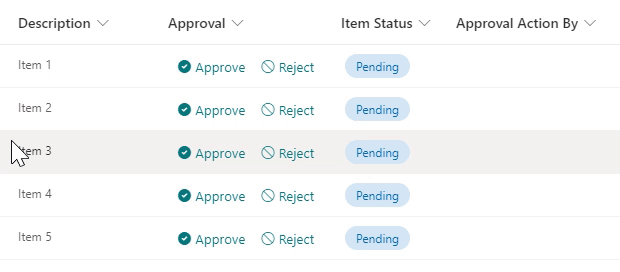

# Inline Approval

## Podsumowanie
Ta próbka tworzy buttons to approve/reject an item by updating an Approval Status field created using a choice field, and also set the value of a person field to the user who took the action by using the setValue action as seen below:

Key points:

- For the buttons, the CSS display property will be set to 'none' when the status is not empty and is different than 'Pending'. And the custom JSON will display a text message stating that the item was already approved or rejected in this case.
- When the item is not approved or rejected yet, the buttons are displayed so the user can take an action (Approve or Reject).

## Wymagania widoku

|Type|Internal Name|Required|Additional Information
|---|---|:---:|---|
|Any (see below)|Approval|Yes| Apply [approval-buttons-setValue-status-user.json](./approval-buttons-setValue-status-user.json) to this column
|Choice|ItemStatus|No| Choice values needed: (Pending / Approved / Rejected) Default: Pending
|Person or Group|ApprovalActionBy|No|Single selection

- Format can be applied to any column, although it is recommended to add it to a calculated column with a `=""` formula

## Przykład

Rozwiązanie|Autor(zy)
--------|---------
approval-buttons-setValue-status-user.json | [Michel Mendes](https://github.com/michelcarlo)

## Historia wersji

Wersja |Data          |Uwagi
--------|--------------|--------------------------------
1.0     |November 19, 2021 |Wersja początkowa

## Zastrzeżenie
**TEN KOD JEST DOSTARCZANY W STANIE *TAKIM, W JAKIM JEST*, BEZ JAKIEJKOLWIEK GWARANCJI, WYRAŹNEJ ANI DOROZUMIANEJ, W TYM TAKŻE DOROZUMIANYCH GWARANCJI PRZYDATNOŚCI DO OKREŚLONEGO CELU, WARTOŚCI HANDLOWEJ ANI NIENARUSZANIA PRAW.**
##

