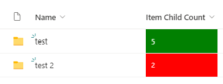

# Change color based on Item Child Count

## Podsumowanie
Ta próbka wyświetla wartość kolumny Item Child Count na zielono, gdy przesłano 5 dokumentów. Jeśli przesłano mniej lub więcej niż 5 dokumentów, pole również zostanie odpowiednio sformatowane.

Sample can be extended to different colors or values based on your requirements.

## Wymagania widoku
- This format can only be applied to the Item Child Count field. Add this field to your view by clicking on "Add Column" - "Show or hide columns"

## Przykład

Rozwiązanie|Autor(zy)
--------|---------
childcount-color-change.json | [Marijn Somers](https://github.com/marijnsomers)

## Historia wersji

Wersja|Data|Uwagi
-------|----|--------
1.0|20 lutego 2023|Wersja początkowa

## Zastrzeżenie
**TEN KOD JEST DOSTARCZANY W STANIE *TAKIM, W JAKIM JEST*, BEZ JAKIEJKOLWIEK GWARANCJI, WYRAŹNEJ ANI DOROZUMIANEJ, W TYM TAKŻE DOROZUMIANYCH GWARANCJI PRZYDATNOŚCI DO OKREŚLONEGO CELU, WARTOŚCI HANDLOWEJ ANI NIENARUSZANIA PRAW.**

---

## Dodatkowe uwagi

- Brak

