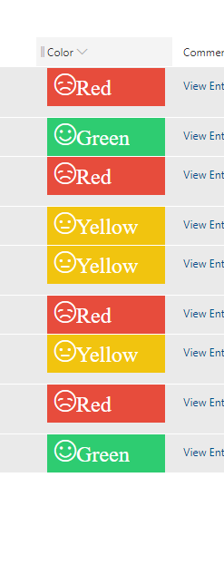

# Color Based Emojis

## Podsumowanie
Ta próbka wyświetla buźki (emoji) na podstawie koloru. Format dodaje ikonę buźki z Fluent UI. Jeśli wartość to `Green`, użyta zostanie ikona `Emoji2`, jeśli `Yellow` to `EmojiNeutral`, a jeśli `Red` to `EmojiDisappointed`.

Sample can be extended to different colors based on your requirements.

## Wymagania widoku
- Ten format można zastosować do a Choice, Single line of text column

## Przykład

Rozwiązanie|Autor(zy)
--------|---------
color-based-smiley-face.json | [Siddharth Vaghasia](https://github.com/siddharth-vaghasia)

## Historia wersji

Wersja|Data|Uwagi
-------|----|--------
1.0|June 16, 2019|Wersja początkowa

## Zastrzeżenie
**TEN KOD JEST DOSTARCZANY W STANIE *TAKIM, W JAKIM JEST*, BEZ JAKIEJKOLWIEK GWARANCJI, WYRAŹNEJ ANI DOROZUMIANEJ, W TYM TAKŻE DOROZUMIANYCH GWARANCJI PRZYDATNOŚCI DO OKREŚLONEGO CELU, WARTOŚCI HANDLOWEJ ANI NIENARUSZANIA PRAW.**

---

## Dodatkowe uwagi
Ta próbka wykorzystuje icons from the Office UI Fabric

- [Office UI Fabric](https://developer.microsoft.com/en-us/fabric)

> An additional version using Abstract Tree Syntax (AST) is also provided for environments where the Excel-style expressions are not supported.

