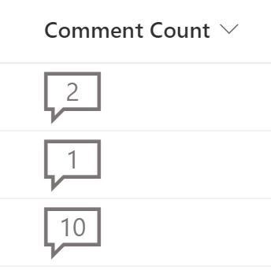

# Liczba komentarzy

## Podsumowanie
Ta próbka dodaje wizualny wskaźnik do elementu listy, pokazując liczbę komentarzy, które się do niego odnoszą. Osiąga się to za pomocą wbudowanego odwołania [$_CommentCount], które zwraca liczbę komentarzy dla bieżącego elementu.

  

## Wymagania widoku
Można to dodać do dowolnej kolumny, nadpisując jej zawartość. Możesz na przykład utworzyć pustą kolumnę typu pojedyncza linia tekstu o nazwie Liczba komentarzy i sformatować ją za pomocą tej próbki.

Nazwa kolumny|Typ
--------|---------
Liczba komentarzy  | Pojedyncza linia tekstu.

## Wideo

To rozwiązanie zostało pokazane i nagrane podczas spotkania General M365 Dev SIG 18 marca 2021 roku. Możesz obejrzeć nagranie na YouTube.

## Przykład

Rozwiązanie|Autor(zy)
--------|---------
comment-count.json | [Chris Kent](https://github.com/thechriskent)

## Historia wersji

Wersja|Data|Uwagi
-------|----|--------
1.0|19 marca 2021|Wersja początkowa
2.0|20 sierpnia 2021|Dodano README

## Zastrzeżenie
**TEN KOD JEST DOSTARCZANY W STANIE *TAKIM, W JAKIM JEST*, BEZ JAKIEJKOLWIEK GWARANCJI, WYRAŹNEJ ANI DOROZUMIANEJ, W TYM TAKŻE DOROZUMIANYCH GWARANCJI PRZYDATNOŚCI DO OKREŚLONEGO CELU, WARTOŚCI HANDLOWEJ ANI NIENARUSZANIA PRAW.**

---

## Dodatkowe uwagi

