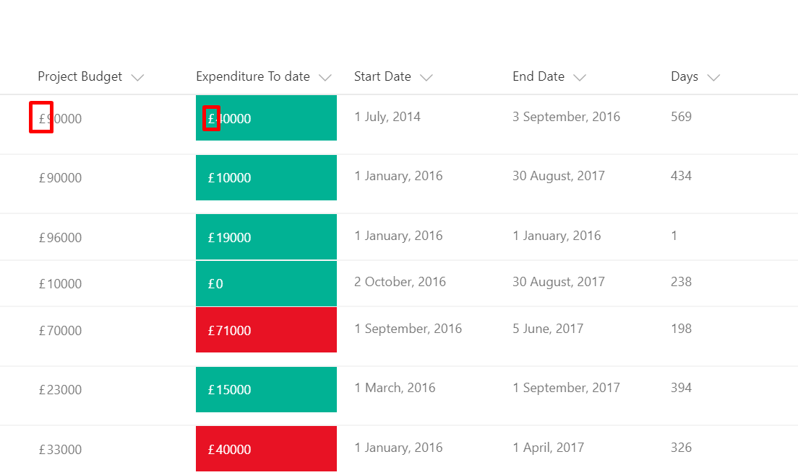

# Concatenate Currency Symbol

## Podsumowanie
Currency column is currently not supported*, hence this sample will allow the users to concatenate a currency symbol(£, $ ... etc.) to the existing data. This sample will compare two numeric columns and add a currrency symbol. In this example, two columns (Budget Approved and Expenditure To Data) from a Project Register has been used.

> \*this is no longer true, but this sample still provides an example of string concatenation that some will find helpful

### Project Budget Column with a Currency Symbol
Project Register where ‘Project Budget’ column is compared with the 'Expenditure To Data' column and formated based on the condition with Red or Green color. Please note that both columns must be a number type for this to work.

If you only need to add a symbol to a numeric column without any formatting, please use the [addsymbolonly.json](./addsymbolonly.json) format.

A similar technique could be used for adding any text to existing data or empty column. 

## Wymagania widoku
- Format should be applied to a Liczba column
- An additional Liczba column with an internal name of `ProjectBudget` is expected

## Przykład

Rozwiązanie|Autor(zy)
--------|---------
currency-symbol-concatenation.json | [S Merchant](https://github.com/sohailmerchant)
addsymbolonly.json | [S Merchant](https://github.com/sohailmerchant)

## Historia wersji

Wersja|Data|Uwagi
-------|----|--------
1.0|15 stycznia 2018|Wersja początkowa
1.1|20 sierpnia 2018|Zaktualizowano do użycia wyrażeń w stylu Excela

## Zastrzeżenie
**TEN KOD JEST DOSTARCZANY W STANIE *TAKIM, W JAKIM JEST*, BEZ JAKIEJKOLWIEK GWARANCJI, WYRAŹNEJ ANI DOROZUMIANEJ, W TYM TAKŻE DOROZUMIANYCH GWARANCJI PRZYDATNOŚCI DO OKREŚLONEGO CELU, WARTOŚCI HANDLOWEJ ANI NIENARUSZANIA PRAW.**

---

## Dodatkowe uwagi

> Dodatkowe wersje wykorzystujące Abstract Tree Syntax (AST) są również dostępne dla środowisk, w których wyrażenia w stylu Excela nie są obsługiwane.

