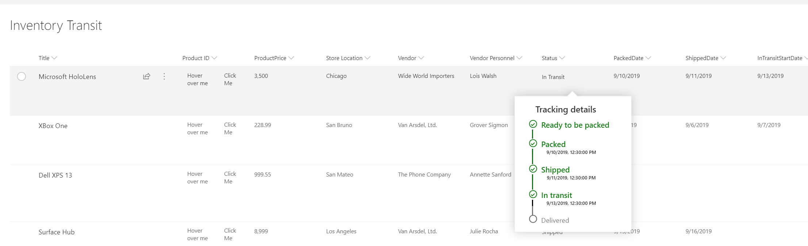

# Custom Hover Card (Column)

## Podsumowanie
A custom card is shown on hover of an item. The hover card shows additional details about an item's status.

## Wymagania widoku
- Ten format można zastosować do any column type though the example is based on - 

Nazwa wewnętrzna|Typ|Uwagi
--------------------|---------------|------------
Status              | Choice        |
StatusCode          | Liczba        |This field is assumed to be set to a value of 0, 1, 2, 3, or 4
PackedDate          | Data and Time |
ShippedDate         | Data and Time |
InTransitStartDate  | Data and Time |
DeliveredDate       | Data and Time |

## Przykład

Rozwiązanie|Autor(zy)
--------|---------
custom-hover-card.json | [Niket Jain](https://github.com/NiketJain)

## Historia wersji

Wersja|Data|Uwagi
-------|----|--------
1.0|08 kwietnia 2020|Wersja początkowa
1.1|15 listopada 2023|Poprawiono view requirements in README.md and added `)` that was missing in JSON

## Zastrzeżenie
**TEN KOD JEST DOSTARCZANY W STANIE *TAKIM, W JAKIM JEST*, BEZ JAKIEJKOLWIEK GWARANCJI, WYRAŹNEJ ANI DOROZUMIANEJ, W TYM TAKŻE DOROZUMIANYCH GWARANCJI PRZYDATNOŚCI DO OKREŚLONEGO CELU, WARTOŚCI HANDLOWEJ ANI NIENARUSZANIA PRAW.**

---

## Dodatkowe uwagi
Ta próbka wykorzystuje icons from the Office UI Fabric

- [Office UI Fabric](https://developer.microsoft.com/en-us/fabric)

