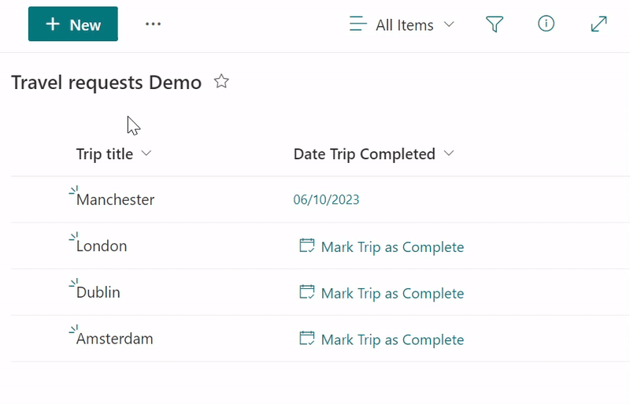

# Set Data to Today's Data (Tylko data)

## Podsumowanie
Ta próbka dodaje przycisk „Mark Trip as Complete” (pole daty). 
This button uses the 'setValue' action to set a Data field value to Today's date by using the token @now and formatting it in a way that we exclude the time piece (a string in the format ‘yyyy-MM-dd’).

## Wymagania widoku

|Type|Internal Name|Wymagane|Dodatkowe informacje
|---|---|:---:|---|
|Tylko data|DateTripCompleted|Yes| Apply [date-button-setValue-today.json](./date-button-setValue-today.json) to this column

## Przykład

Rozwiązanie|Autor(zy)
--------|---------
date-button-setValue-today.json | [Michel Mendes](https://github.com/michelcarlo)

## Historia wersji

Wersja |Data          |Uwagi
--------|--------------|--------------------------------
1.0     |stycznia 15, 2023 |Wersja początkowa

## Zastrzeżenie
**TEN KOD JEST DOSTARCZANY W STANIE *TAKIM, W JAKIM JEST*, BEZ JAKIEJKOLWIEK GWARANCJI, WYRAŹNEJ ANI DOROZUMIANEJ, W TYM TAKŻE DOROZUMIANYCH GWARANCJI PRZYDATNOŚCI DO OKREŚLONEGO CELU, WARTOŚCI HANDLOWEJ ANI NIENARUSZANIA PRAW.**

