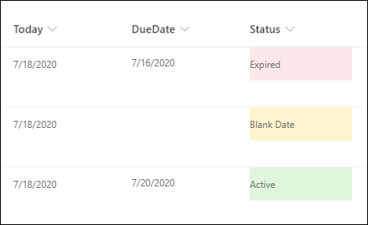

# Formatting a column when a date column is blank

## Podsumowanie
This example populates the text content and applies different classes to the Status field depending on the value inside an item's DueDate field. This example applies formatting to one field by looking at the value inside another field. Note that DueDate is referenced using the `[$FieldName]` syntax. FieldName is assumed to be the internal name of the field. This example also takes advantage of a special value that can be used in date/time fields - `@now`, which resolves to the current date/time, evaluated when the user loads the list view.

The text content and classes applied are determined based on following conditions:

|Condition|txtContent|Class|
|---|---|---|
|DueDate is blank|Blank Data|sp-field-severity--warning|
|DueDate < Now|Expired|sp-field-severity--blocked|
|Else|Active|sp-field-severity--good|

## Wymagania widoku
- Ten format można zastosować do a Pojedyncza linia tekstu or Choice column
- An additional DateTime column with an internal name of `DueDate`

## Przykład

Rozwiązanie|Autor(zy)
--------|---------
date-check-blank-format.json | [Ganesh Sanap](https://github.com/ganesh-sanap)

## Historia wersji

Wersja|Data|Uwagi
-------|----|--------
1.0|18 lipca 2020|Wersja początkowa

## Zastrzeżenie
**TEN KOD JEST DOSTARCZANY W STANIE *TAKIM, W JAKIM JEST*, BEZ JAKIEJKOLWIEK GWARANCJI, WYRAŹNEJ ANI DOROZUMIANEJ, W TYM TAKŻE DOROZUMIANYCH GWARANCJI PRZYDATNOŚCI DO OKREŚLONEGO CELU, WARTOŚCI HANDLOWEJ ANI NIENARUSZANIA PRAW.**

---

## Dodatkowe uwagi
Ta próbka wykorzystuje some predefined classes also covered in the official documentation of Column Formatting:

- [Use column formatting to customize SharePoint - Style guidelines](https://docs.microsoft.com/en-us/sharepoint/dev/declarative-customization/column-formatting#style-guidelines)

