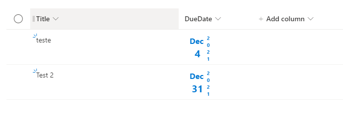

# Formatting of Data column to compress date value in different style.

## Podsumowanie
Ta próbka wprowadza inny styl prezentacji daty w skompresowanej formie, na przykład przez wyrównanie dnia i miesiąca oraz pionowe wyświetlenie roku.

## Wymagania widoku
- Ten format można zastosować do any date time `Column`

## Przykład

Rozwiązanie|Autor(zy)
--------|---------
date-compress-format.json | [André Lage](https://github.com/aaclage)

## Historia wersji

Wersja|Data|Uwagi
-------|----|--------
1.0|6 grudnia 2021|Wersja początkowa
1.1|23 marca 2024|Poprawiono to use `@currentField` instead of column specific name `[$DueDate]`

## Zastrzeżenie
**TEN KOD JEST DOSTARCZANY W STANIE *TAKIM, W JAKIM JEST*, BEZ JAKIEJKOLWIEK GWARANCJI, WYRAŹNEJ ANI DOROZUMIANEJ, W TYM TAKŻE DOROZUMIANYCH GWARANCJI PRZYDATNOŚCI DO OKREŚLONEGO CELU, WARTOŚCI HANDLOWEJ ANI NIENARUSZANIA PRAW.**

