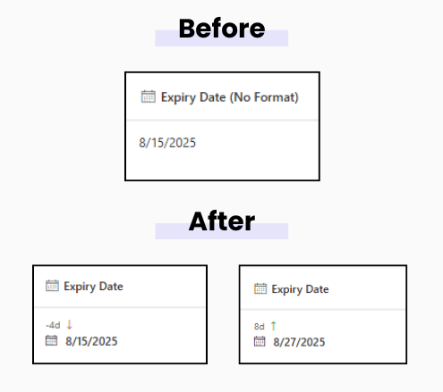

# Days Counter

## Podsumowanie  
Ta próbka pokazuje how many days are left until a date or how many days have passed since a date, right inside a SharePoint list column. Color-coded for quick scanning.

## Wymagania widoku
Ten format można zastosować do a Date column.

## Przykład
Rozwiązanie|Autor(zy)
--------|---------
date-day-counter.json | [Tanel Vahk](https://github.com/tvahk)

## Historia wersji
Wersja |Data             |Uwagi
--------|-----------------|--------------------------------
1.0     |August 19, 2025 |Wersja początkowa

## Zastrzeżenie
**TEN KOD JEST DOSTARCZANY W STANIE *TAKIM, W JAKIM JEST*, BEZ JAKIEJKOLWIEK GWARANCJI, WYRAŹNEJ ANI DOROZUMIANEJ, W TYM TAKŻE DOROZUMIANYCH GWARANCJI PRZYDATNOŚCI DO OKREŚLONEGO CELU, WARTOŚCI HANDLOWEJ ANI NIENARUSZANIA PRAW.**

