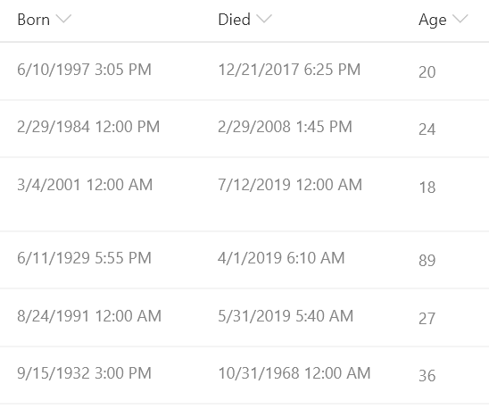

# Date Difference

## Podsumowanie
Ta próbka pokazuje calculating the difference between 2 dates. In this sample the age in years is calculated based on the date of birth and the date of death. This format could easily be adjusted to calculate a different unit of time (months, days, hours, minutes, etc.) by adjusting the multiplier.

## Wymagania widoku
Ten format można zastosować do any column, however it expects the following fields to be present in the view:

|Type|Internal Name|Required|
|---|---|:---:|
|Date|Born|Yes|
|Date|Died|Yes|

## Przykład

Rozwiązanie|Autor(zy)
--------|---------
date-difference.json | [Chris Kent](https://github.com/thechriskent)

## Historia wersji

Wersja|Data|Uwagi
-------|----|--------
1.0|October 2, 2019|Wersja początkowa

## Zastrzeżenie
**TEN KOD JEST DOSTARCZANY W STANIE *TAKIM, W JAKIM JEST*, BEZ JAKIEJKOLWIEK GWARANCJI, WYRAŹNEJ ANI DOROZUMIANEJ, W TYM TAKŻE DOROZUMIANYCH GWARANCJI PRZYDATNOŚCI DO OKREŚLONEGO CELU, WARTOŚCI HANDLOWEJ ANI NIENARUSZANIA PRAW.**

---

## Dodatkowe uwagi

- [Użyj formatowania kolumn do dostosowania SharePoint](https://docs.microsoft.com/en-us/sharepoint/dev/declarative-customization/column-formatting)

