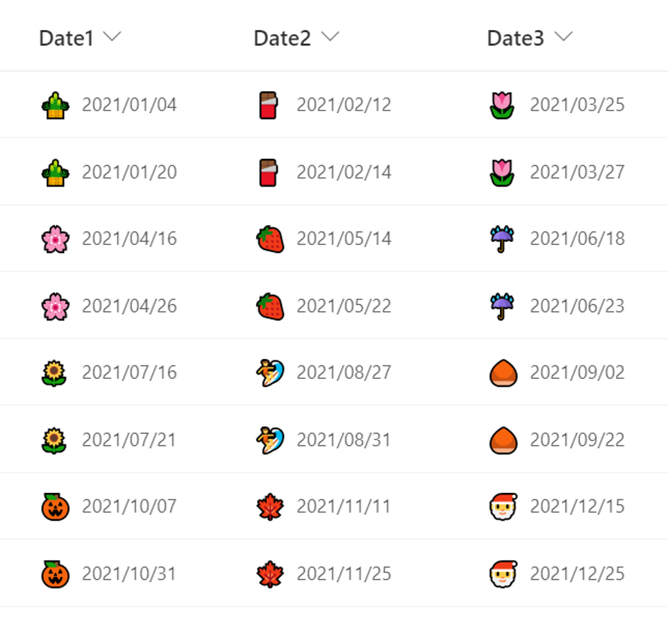

# Monthly Emoji

## Podsumowanie
Ta próbka pokazuje how to display a emoji representing the month of the date to the left of the date.

The correspondence between the months and emoji in this sample is as follows:

Month     |Emoji
----------|------
January   |🎍
February  |🍫
March     |🌷
April     |🌸
May       |🍓
June      |☔
July      |🌻
August    |🏄
September |🌰
October   |🎃
November  |🍁
December  |🎅

## Wymagania widoku
Ten format można zastosować do a Date column

## Przykład

Rozwiązanie|Autor(zy)
--------|---------
date-monthly-emoji.json | [Tetsuya Kawahara](https://github.com/tecchan1107)

## Historia wersji

Wersja |Data             |Uwagi
--------|-----------------|--------
1.0     |October 17, 2021 |Wersja początkowa

## Zastrzeżenie
**TEN KOD JEST DOSTARCZANY W STANIE *TAKIM, W JAKIM JEST*, BEZ JAKIEJKOLWIEK GWARANCJI, WYRAŹNEJ ANI DOROZUMIANEJ, W TYM TAKŻE DOROZUMIANYCH GWARANCJI PRZYDATNOŚCI DO OKREŚLONEGO CELU, WARTOŚCI HANDLOWEJ ANI NIENARUSZANIA PRAW.**

