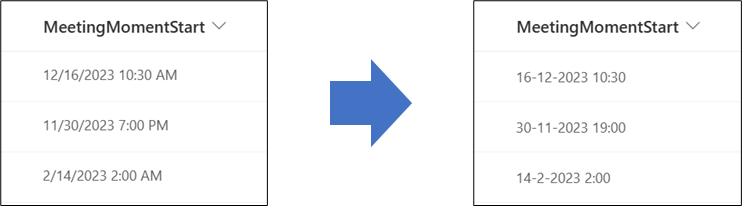

# Data Notation

## Podsumowanie
Ta próbka przedstawia a way to make sure that the notation of a date and time column in SharePoint is forced in a specific notation.

In Power Apps we can use Power Fx:
`text(ThisItem.DateTimeColumn, 'yyyy-mm-dd')`
to force the notation to be 'yyyy-mm-dd'

In Power Automate we can use Workflow Definition Language:
`formatDateTime(convertFromUtc(utcNow(), 'W. Europe Standard Time'), 'yyyy-MM-dd')`
to force the notation to be 'yyyy-MM-dd'

In SharePoint Column Formatting I was not able to find a generic expression that can easily do this on a date and time value. Therefor this sample can be useful if different users have different regional settings or if the Time Format setting in the Site Settings is greyed out, but you want to make sure that a date and time value is shown in a specific format / in a specific notation.

## Wymagania widoku
Ten format można zastosować do a date column with time enabled.

## Przykład

Rozwiązanie|Autor(zy)
--------|---------
date-notation.json | [Django Lohn](https://github.com/m3ngi3)

## Historia wersji

Wersja|Data|Uwagi
-------|----|--------
1.0|8 lutego 2023|Wersja początkowa

## Zastrzeżenie
**TEN KOD JEST DOSTARCZANY W STANIE *TAKIM, W JAKIM JEST*, BEZ JAKIEJKOLWIEK GWARANCJI, WYRAŹNEJ ANI DOROZUMIANEJ, W TYM TAKŻE DOROZUMIANYCH GWARANCJI PRZYDATNOŚCI DO OKREŚLONEGO CELU, WARTOŚCI HANDLOWEJ ANI NIENARUSZANIA PRAW.**

---

## Dodatkowe uwagi
- I verified this formatting for Dutch and English Locales (Regional Settings) of the SharePoint Site. Some locales may not be displayed correctly.
- This format allows the date and time to be displayed in the local PC time zone, instead of the site's time zone.
- Please let me know if you have a scenario that is not accounted for in my generic example when it comes regional settings logic. Maybe we can add more logic to this script together.

