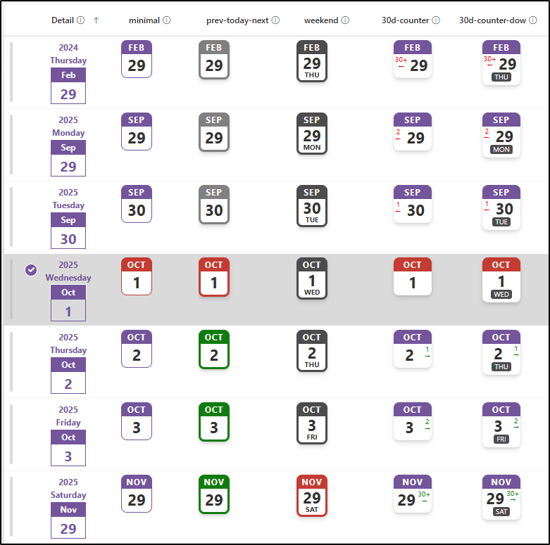

# Page-a-day Calendar

## Podsumowanie
Ta próbka dostosowuje kolumnę daty tak, aby wyglądała jak kalendarz z odrywanymi kartkami. Wykorzystuje do tego funkcje części daty (`getDate`, `getMonth` i `getYear`). Dni tygodnia są wyświetlane z użyciem kongruencji Zellera oraz metody Tomohiko Sakamoto.

## Wymagania widoku
Ten format można zastosować do a Data column.

## Przykład

Rozwiązanie|Autor(zy)
--------|---------
date-page-a-day-calendar.json | [Tetsuya Kawahara](https://github.com/tecchan1107)
date-page-a-day-calendar-minimal.json         | [Watana](https://github.com/watana2)
date-page-a-day-calendar-prev-today-next.json | [Watana](https://github.com/watana2)
date-page-a-day-calendar-weekend.json         | [Watana](https://github.com/watana2)
date-page-a-day-calendar-30d-counter.json     | [Watana](https://github.com/watana2)
date-page-a-day-calendar-30d-counter-dow.json | [Watana](https://github.com/watana2)

## Historia wersji

Wersja |Data              |Uwagi
--------|------------------|--------
1.0     |października 17, 2020  |Wersja początkowa
1.1     |sierpnia  2, 2021   |Poprawiono to show days of the week.
1.2     |października 2, 2022   |Poprawiono incorrect days of the week being displayed.
1.3     |grudnia 13, 2024 |Dodano `date-page-a-day-calendar-minimal.json`
1.4     |grudnia 14, 2024 |Adjusted the layout for `date-page-a-day-calendar.json` to ensure that the day-of-the-week text, which was partially hidden due to the update, is now visible.
1.5     |września 1, 2025 |Dodano `date-page-a-day-calendar-prev-today-next.json`
1.6     |września 13, 2025|Dodano `date-page-a-day-calendar-weekend.json`
1.7     |października 1, 2025   |Dodano `date-page-a-day-calendar-30d-counter.json` & `date-page-a-day-calendar-30d-counter-dow.json` and refactored previous samples.

## Zastrzeżenie
**TEN KOD JEST DOSTARCZANY W STANIE *TAKIM, W JAKIM JEST*, BEZ JAKIEJKOLWIEK GWARANCJI, WYRAŹNEJ ANI DOROZUMIANEJ, W TYM TAKŻE DOROZUMIANYCH GWARANCJI PRZYDATNOŚCI DO OKREŚLONEGO CELU, WARTOŚCI HANDLOWEJ ANI NIENARUSZANIA PRAW.**

## Dodatkowe uwagi
- [Zeller's congruence](https://en.wikipedia.org/wiki/Zeller%27s_congruence)
- [Tomohiko Sakamoto's methods](https://en.wikipedia.org/wiki/Determination_of_the_day_of_the_week)

