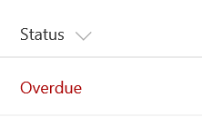

# Overdue Data

## Podsumowanie
This example colors the current field red when the value inside an item's DueDate is before the current date/time. Unlike some of the previous examples, this example applies formatting to one field by looking at the value inside another field. Note that DueDate is referenced using the [$FieldName] syntax. FieldName is assumed to be the internal name of the field. This example also takes advantage of a special value that can be used in date/time fields - `@now`, which resolves to the current date/time, evaluated when the user loads the list view.

> Although the color can be specified directly in a style property, the [Fluent UI](https://developer.microsoft.com/en-us/fabric#/styles/colors) `ms-fontColor-redDark` class is used to ensure the color matches the defined Office styles.

## Wymagania widoku
- Ten format można zastosować do any column type
- An additional DateTime column with an internal name of `DueDate`

## Przykład

Rozwiązanie|Autor(zy)
--------|---------
date-range-format.json | [SharePoint Team](https://github.com/SharePoint)

## Historia wersji

Wersja|Data|Uwagi
-------|----|--------
1.0|2 listopada 2017|Wersja początkowa
1.1|22 marca 2018|Minor color adjustment
1.2|17 sierpnia 2018|Changed color from style to class and switched to Excel-style expressions

## Zastrzeżenie
**TEN KOD JEST DOSTARCZANY W STANIE *TAKIM, W JAKIM JEST*, BEZ JAKIEJKOLWIEK GWARANCJI, WYRAŹNEJ ANI DOROZUMIANEJ, W TYM TAKŻE DOROZUMIANYCH GWARANCJI PRZYDATNOŚCI DO OKREŚLONEGO CELU, WARTOŚCI HANDLOWEJ ANI NIENARUSZANIA PRAW.**

---

## Dodatkowe uwagi
Ta próbka jest również opisana w głównej dokumentacji dotyczącej formatowania kolumn

- [Użyj formatowania kolumn do dostosowania SharePoint](https://docs.microsoft.com/en-us/sharepoint/dev/declarative-customization/column-formatting)

> Dodatkowa wersja wykorzystująca Abstract Tree Syntax (AST) jest również dostępna dla środowisk, w których wyrażenia w stylu Excela nie są obsługiwane.

