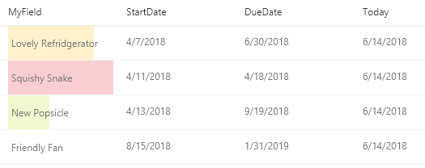
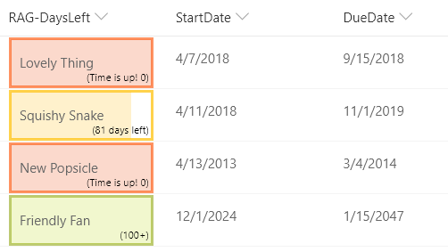

# Red-Amber-Green (RAG) Bars Based on Data Ranges

## Podsumowanie
This example creates colored data bars on the current field based on `DueDate` and `StartDate` fields compared to the current date/time.

## date-range-rag.json
This example creates colored data bars on the current field based on `DueDate` and `StartDate` fields compared to the current date/time. The bar fills towards 100% as "Today" approaches the due date. A percentage width is determined based on the total number of days between the StartDate of the item and the DueDate of the item.

Unlike some of the other examples, this one applies formatting to one field by looking at the value inside other fields. Note that `DueDate` and `StartDate` are referenced using the `[$FieldName]` syntax where FieldName is the internal name of the field. This example also takes advantage of a special value that can be used in date/time fields - `@now`, which resolves to the current date/time, evaluated when the user loads the list view.

>Note that the Today column shown above is not used in the format. It's provided for reference so that you can see how the format was applied with the given dates.

The colors used are determined by the classes applied:

|Condition|Class|
|---|---|
|DueDate <= Now|sp-field-severity--severeWarning|
|Liczba of days passed between StartDate & DueDate > 70% of the total days|sp-field-severity--warning|
|Else|sp-field-severity--good|

If the `DueDate` has not yet passed, the width of the bar is determined by calculating the percentage of days that have passed from `StartDate` and the `DueDate`.

Additionally, the value of the field (`@currentField`) is displayed when there is a value.

## date-range-rag-days-left.json

In this version of the sample, the days left are displayed within the box:

## Wymagania widoku
- Ten format można zastosować do any column type
- An additional DateTime column with an internal name of `DueDate` is expected
- An additional DateTime column with an internal name of `StartDate` is expected

## Przykład

Rozwiązanie|Autor(zy)
--------|---------
date-range-rag.json | [Christopher Parker](https://github.com/ChrispyBites)
date-range-rag-days-left.json | [Joe Ayre](https://github.com/JoeAyre)

## Historia wersji

Wersja|Data|Uwagi
-------|----|--------
1.0|13 czerwca 2018|Wersja początkowa
1.1|25 lipca 2018|Updated to include amber class
1.2|20 sierpnia 2018|Updated to use Excel-style expressions, add a theme font class, and to simplify the calculations
1.3|12 sierpnia 2019|Dodano days-left sample
1.4|1 listopada 2021|[Zylantha](https://github.com/zylantha) simplified days-left calculation

## Zastrzeżenie
**TEN KOD JEST DOSTARCZANY W STANIE *TAKIM, W JAKIM JEST*, BEZ JAKIEJKOLWIEK GWARANCJI, WYRAŹNEJ ANI DOROZUMIANEJ, W TYM TAKŻE DOROZUMIANYCH GWARANCJI PRZYDATNOŚCI DO OKREŚLONEGO CELU, WARTOŚCI HANDLOWEJ ANI NIENARUSZANIA PRAW.**

---

## Dodatkowe uwagi

- [Użyj formatowania kolumn do dostosowania SharePoint](https://docs.microsoft.com/en-us/sharepoint/dev/declarative-customization/column-formatting)

> Dodatkowa wersja wykorzystująca Abstract Tree Syntax (AST) jest również dostępna dla środowisk, w których wyrażenia w stylu Excela nie są obsługiwane.

