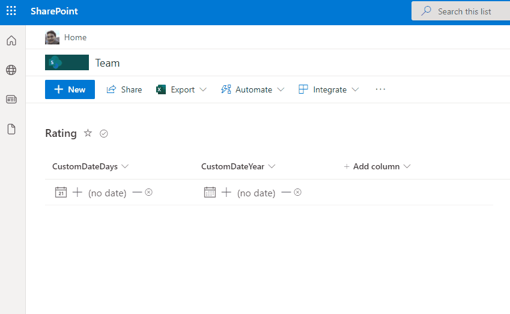

# Date Update Format

## Podsumowanie
Ta próbka pokazuje updating a date value directly from the format. This includes setting the date to the current date/time, incremeting/decrementing the date by day (alternate format included to demonstrate incrementing/decrementing by year), and clearing the date.

## Wymagania widoku
- Format expect the following fields:

Field |Type
--------|---------
Title | Single line of text 
CustomDate | Date and Time

## Przykład

Rozwiązanie|Autor(zy)
--------|---------
date-update-format.json | [André Lage](https://github.com/aaclage)
date-update-format-years.json | [André Lage](https://github.com/aaclage)

## Historia wersji

Wersja|Data|Uwagi
-------|----|--------
1.0|December 09, 2021|Wersja początkowa

## Zastrzeżenie
**TEN KOD JEST DOSTARCZANY W STANIE *TAKIM, W JAKIM JEST*, BEZ JAKIEJKOLWIEK GWARANCJI, WYRAŹNEJ ANI DOROZUMIANEJ, W TYM TAKŻE DOROZUMIANYCH GWARANCJI PRZYDATNOŚCI DO OKREŚLONEGO CELU, WARTOŚCI HANDLOWEJ ANI NIENARUSZANIA PRAW.**

