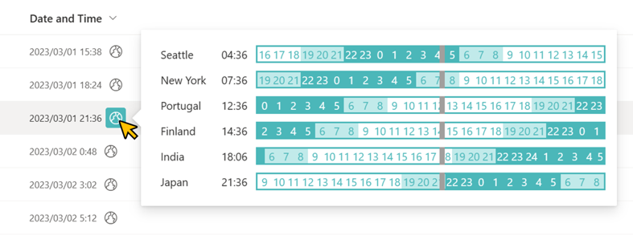

# Czas na świecie

## Podsumowanie

Ta próbka pokazuje displaying the times of countries and regions of the world for a date column value that includes the time.



- The countries and regions to display can be added or removed by editing the string of the first argument of the `split` operator on line 45. Poniższe notes apply to editing that string.
    - The string must be `[time difference from UTC]|[name of country or region]` separated by commas.
    - If you want to use spaces for the country or region name, use - (half-width hyphen). The - (half-width hyphen) will be replaced with a half-width space and displayed on the screen. Including spaces in the string will prevent the custom card from displaying.

- Here is an example of the settings for line 45:
    ```
    "forEach": "UTC in split('-8|Seattle,-5|New-York,0|Portugal,2|Finland,5.5|India,9|Japan',',')",
    ```

## Wymagania widoku

Ten format można zastosować do a Data column.

## Przykład

Rozwiązanie|Autor(zy)
--------|---------
date-world-time.json | [Tetsuya Kawahara](https://github.com/tecchan1107)

## Historia wersji

Wersja |Data          |Uwagi
--------|--------------|--------
1.0     |marca 3, 2023 |Wersja początkowa

## Zastrzeżenie

**TEN KOD JEST DOSTARCZANY W STANIE *TAKIM, W JAKIM JEST*, BEZ JAKIEJKOLWIEK GWARANCJI, WYRAŹNEJ ANI DOROZUMIANEJ, W TYM TAKŻE DOROZUMIANYCH GWARANCJI PRZYDATNOŚCI DO OKREŚLONEGO CELU, WARTOŚCI HANDLOWEJ ANI NIENARUSZANIA PRAW.**

