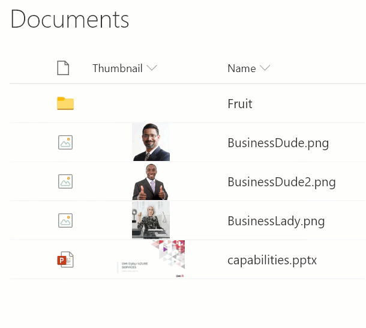
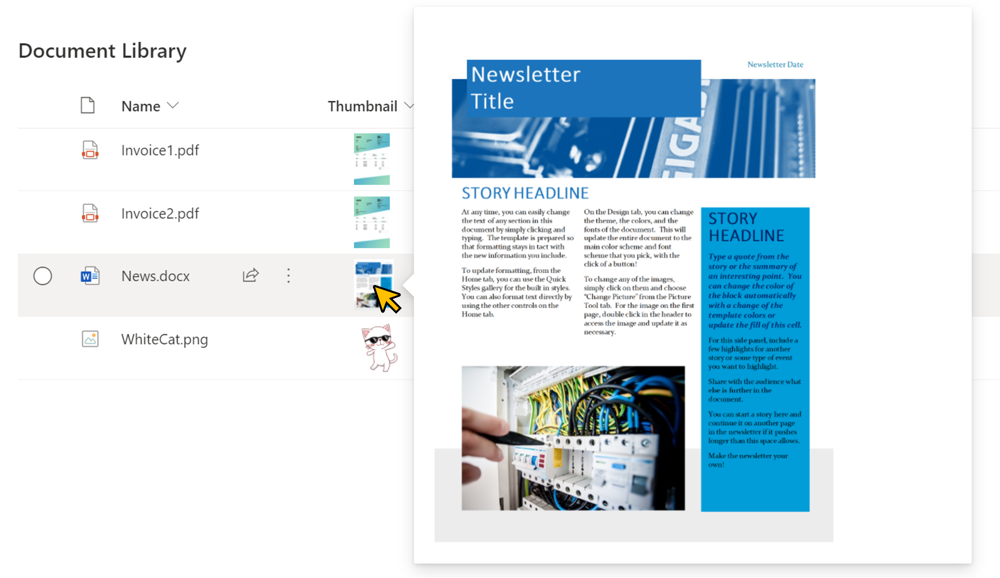

# File Thumbnails

## Podsumowanie
Ta próbka wykorzystuje token zastępczy `@thumbnail`, aby utworzyć podgląd osadzony bezpośrednio w dokumencie biblioteki. Foldery i typy plików, dla których podgląd nie jest dostępny, nie będą wyświetlane.

`file-thumbnail-lightbox.json` displays enlarged thumbnails in a lightbox. Ta próbka pochodzi z [image-lightbox](https://github.com/pnp/List-Formatting/tree/master/column-samples/image-lightbox).

>Note - the automatic removal of the `img` element when dealing with folders or filetypes where previews are not available requires that properties of the `img` element do not use expressions.

## Wymagania widoku
This can be added on any column in a document library, overwriting its contents.

## Przykład

Rozwiązanie|Autor(zy)
--------|---------
file-thumbnail.json | [Chris Kent](https://github.com/thechriskent)
file-thumbnail-lightbox.json | [Tetsuya Kawahara](https://github.com/tecchan1107)

## Historia wersji

Wersja|Data|Uwagi
-------|----|--------
1.0|May 27, 2019|Wersja początkowa
1.1|July 4, 2021|Dodano file-thumbnail-lightbox.json

## Zastrzeżenie
**TEN KOD JEST DOSTARCZANY W STANIE *TAKIM, W JAKIM JEST*, BEZ JAKIEJKOLWIEK GWARANCJI, WYRAŹNEJ ANI DOROZUMIANEJ, W TYM TAKŻE DOROZUMIANYCH GWARANCJI PRZYDATNOŚCI DO OKREŚLONEGO CELU, WARTOŚCI HANDLOWEJ ANI NIENARUSZANIA PRAW.**

---

## Dodatkowe uwagi

- SharePoint Online only

