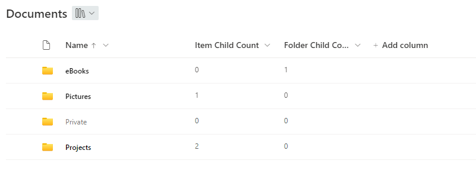
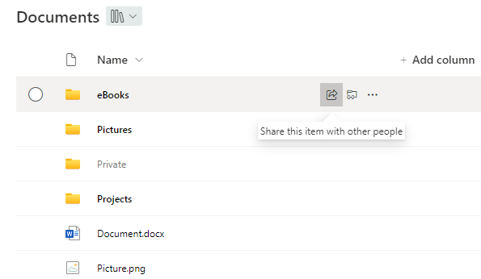

# Highlight non-empty folder

## Podsumowanie
Ta próbka pokazuje how folders can be highlighted or grayed out depending on whether they are empty or not.
It uses the 'Folder Child Count' and 'Item Child Count' columns to check if a folder is empty or not.

**Update**

Dodano a second version ([filename-highlight-non-empty-folders-with-buttons.json](./filename-highlight-non-empty-folders-with-buttons.json)) which brings back the buttons and functions a vanilla name column has. It's possible to share the folder and to open the context menu.

Unfortunately, customRowAction doesn't support creating a shortcut to OneDrive yet. Therefore the 'OneDrive' button is only a placeholder which points out an alternative to create a shortcut. Clicking the button itself has no effect.

> Note - Próbka can be easily adjusted to support only one of the columns. Just delete or replace the '||' and the according column in the json file

## Wymagania widoku
- Ten format można zastosować do Name column in a document library

## Przykład

Rozwiązanie|Autor(zy)
--------|---------
filename-highlight-non-empty-folders.json | [Moritz Lickert](https://github.com/MoeIcI)
filename-highlight-non-empty-folders-with-buttons.json | [Moritz Lickert](https://github.com/MoeIcI)

## Historia wersji

Wersja|Data|Uwagi
-------|----|--------
1.0|October 6, 2023|Wersja początkowa
2.0|January 24, 2024|Included 2nd version with Buttons

## Zastrzeżenie
**TEN KOD JEST DOSTARCZANY W STANIE *TAKIM, W JAKIM JEST*, BEZ JAKIEJKOLWIEK GWARANCJI, WYRAŹNEJ ANI DOROZUMIANEJ, W TYM TAKŻE DOROZUMIANYCH GWARANCJI PRZYDATNOŚCI DO OKREŚLONEGO CELU, WARTOŚCI HANDLOWEJ ANI NIENARUSZANIA PRAW.**

---

