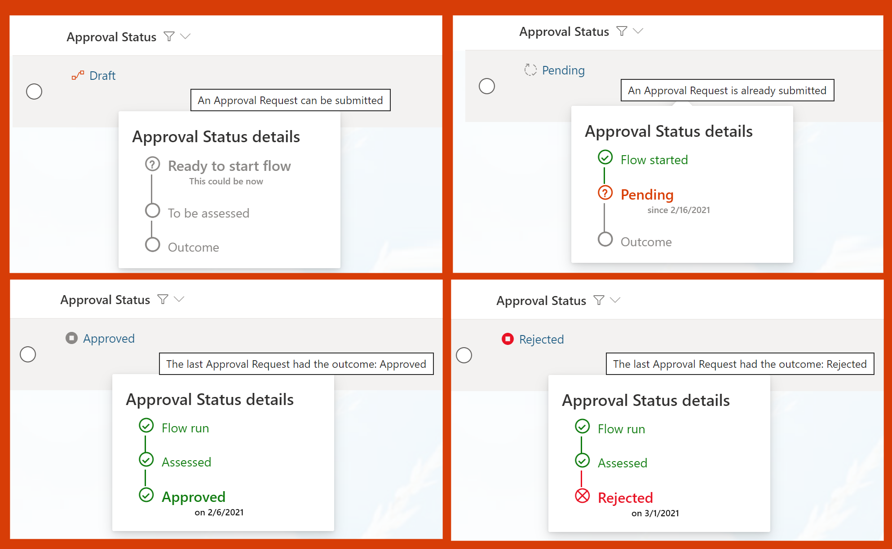

# Approval Status Hover Card

## Podsumowanie
Ta próbka przedstawia more detail on list/library items when the standard Conent Approval flow is enabled. The approval status and a related icon/color are shown with additional details about the overall process visible in a panel on hover.

## Wymagania widoku
Ten format wymaga włączenia zatwierdzania zawartości dla listy lub biblioteki (instrukcja poniżej). Po włączeniu można go zastosować do dowolnej kolumny w widoku, o ile kolumna Approval Status ([$_ModerationStatus]) oraz kolumna Modified ([$Modified]) są również widoczne w tym samym widoku.

### Włącz zatwierdzanie zawartości
On your list use the menu to choose Integrate > Power Automate > Configure flows. In the panel that opens, choose to enable approvals for the library and choose Content approval for the approval mode.

In the Add column menu choose to Show/hide columns and add Approval Status and Modified to your view.

## Przykład

Rozwiązanie|Autor(zy)
--------|---------
generic-approval-status-hover-card.json | [Django Lohn](https://github.com/m3ngi3)

## Historia wersji

Wersja|Data|Uwagi
-------|----|--------
1.0|March 19, 2021|Wersja początkowa

## Zastrzeżenie
**TEN KOD JEST DOSTARCZANY W STANIE *TAKIM, W JAKIM JEST*, BEZ JAKIEJKOLWIEK GWARANCJI, WYRAŹNEJ ANI DOROZUMIANEJ, W TYM TAKŻE DOROZUMIANYCH GWARANCJI PRZYDATNOŚCI DO OKREŚLONEGO CELU, WARTOŚCI HANDLOWEJ ANI NIENARUSZANIA PRAW.**

---

## Dodatkowe uwagi
Ta próbka wykorzystuje icons from Fluent UI

- [Fluent UI Iconography](https://developer.microsoft.com/fluentui#/styles/web/icons)

