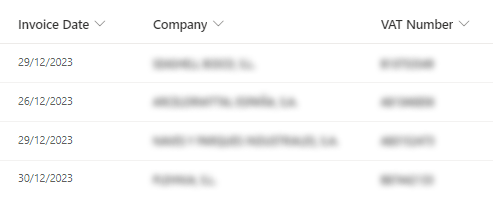

# Blurred Field Value

## Podsumowanie
Ten format pokazuje, jak rozmyć wartość pola.

Możesz użyć tego formatowania, gdy chcesz udostępnić ekran podczas prezentacji i nie pokazywać prawdziwych danych.

## Wymagania widoku
- Ten format można zastosować do any type of column

## Przykład

Rozwiązanie|Autor(zy)
--------|---------
generic-blurred.json | [Julien Aubert](https://github.com/JulienVLC)

## Historia wersji

Wersja|Data|Uwagi
-------|----|--------
1.0|February 08, 2024|Wersja początkowa

## Zastrzeżenie
**TEN KOD JEST DOSTARCZANY W STANIE *TAKIM, W JAKIM JEST*, BEZ JAKIEJKOLWIEK GWARANCJI, WYRAŹNEJ ANI DOROZUMIANEJ, W TYM TAKŻE DOROZUMIANYCH GWARANCJI PRZYDATNOŚCI DO OKREŚLONEGO CELU, WARTOŚCI HANDLOWEJ ANI NIENARUSZANIA PRAW.**

---

## Dodatkowe uwagi

- [Użyj formatowania kolumn do dostosowania SharePoint](https://docs.microsoft.com/sharepoint/dev/declarative-customization/column-formatting)

