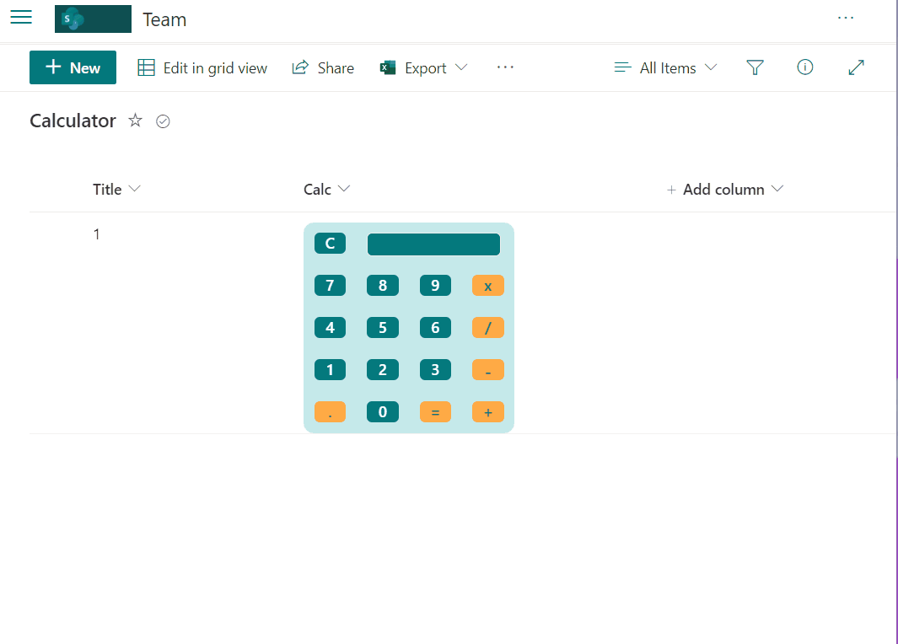

# Calculator

## Podsumowanie
Ta próbka zawiera design capabilities and formulas to simulate a simple calculator.

## Wymagania widoku
- Format oczekuje następujących pól:

Pole |Typ
--------|---------
Calc | Pojedyncza linia tekstu - Calculator format

## Przykład

Rozwiązanie|Autor(zy)
--------|---------
generic-calculator.json | [André Lage](https://github.com/aaclage)

## Historia wersji

Wersja|Data|Uwagi
-------|----|--------
1.0|01 kwietnia 2022|Wersja początkowa

## Zastrzeżenie
**TEN KOD JEST DOSTARCZANY W STANIE *TAKIM, W JAKIM JEST*, BEZ JAKIEJKOLWIEK GWARANCJI, WYRAŹNEJ ANI DOROZUMIANEJ, W TYM TAKŻE DOROZUMIANYCH GWARANCJI PRZYDATNOŚCI DO OKREŚLONEGO CELU, WARTOŚCI HANDLOWEJ ANI NIENARUSZANIA PRAW.**

