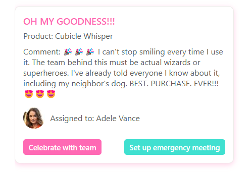

# Card with generic buttons

## Podsumowanie

This is a sample that enables you to show content of various columns (single line of text, person) in a modern card design. It also shows two buttons that can call Power Automate flows for actions like sending emails or scheduling meetings in the context of the list or the list item.

This blog post explains the Power Automate flows in detail: [How to apply modern card design in a SharePoint list with listformatting](https://www.m365princess.com/blogs/sp-card/)

## Wymagania widoku

- Ten format można zastosować do any column type
- It assumes columns `Title`, `Product`, `Assignedto`, `Comment` - please adjust to your needs
- It also gives you the option to define a fallback image in case the person in the `Assignedto` column has no profile picture.

## Przykład

Rozwiązanie|Autor(zy)
--------|---------
generic-card-with-buttons.json | [Luise Freese](https://github.com/luisefreeset)

## Historia wersji

Wersja|Data|Uwagi
-------|----|--------
1.0|October 16, 2024|Wersja początkowa

## Zastrzeżenie

**TEN KOD JEST DOSTARCZANY W STANIE *TAKIM, W JAKIM JEST*, BEZ JAKIEJKOLWIEK GWARANCJI, WYRAŹNEJ ANI DOROZUMIANEJ, W TYM TAKŻE DOROZUMIANYCH GWARANCJI PRZYDATNOŚCI DO OKREŚLONEGO CELU, WARTOŚCI HANDLOWEJ ANI NIENARUSZANIA PRAW.**

---

## Dodatkowe uwagi

None

