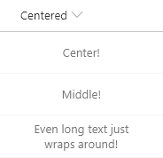

# Centered Content

## Podsumowanie
This is a basic sample that demonstrates making your content be both vertically and horizontally centered (in the middle) within the cell.

## Wymagania widoku
- Ten format można zastosować do any column type

## Przykład

Rozwiązanie|Autor(zy)
--------|---------
generic-centered-content.json | [Chris Kent](https://github.com/thechriskent)

## Historia wersji

Wersja|Data|Uwagi
-------|----|--------
1.0|24 sierpnia 2018|Wersja początkowa

## Zastrzeżenie
**TEN KOD JEST DOSTARCZANY W STANIE *TAKIM, W JAKIM JEST*, BEZ JAKIEJKOLWIEK GWARANCJI, WYRAŹNEJ ANI DOROZUMIANEJ, W TYM TAKŻE DOROZUMIANYCH GWARANCJI PRZYDATNOŚCI DO OKREŚLONEGO CELU, WARTOŚCI HANDLOWEJ ANI NIENARUSZANIA PRAW.**

---

## Dodatkowe uwagi
Brak

