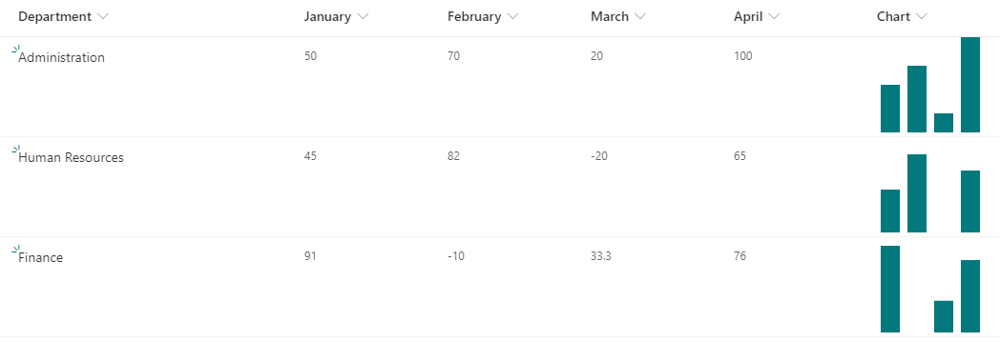

# Inline Column Chart

## Podsumowanie
Ta próbka pokazuje displaying a column chart using SVG. It uses the `currentColor` for the fill value of the SVGs which allows us to use a theme class to make the final SVGs fit your site's theme.

This example shows values from 0 to 100. You can adjust this scale by changing the `d` attribute of the path elements to calculate a percentage rather than use the value directly.

## Wymagania widoku
Ten format można zastosować do any column type. However, it expects to have 4 number columns in the view.

Column Name   |Type
--------------|--------------
stycznia       | Liczba
lutego      | Liczba
marca         | Liczba
kwietnia         | Liczba
Chart         | Any

The column where you apply your format (Chart above) can be any type since it's value is ignored. A calculated column with a formula of `=""` will prevent the field from showing up on your forms.

### Adapting to your fields
Tę próbkę można łatwo dostosować do własnych kolumn. Każda kolumna wykresu używa wewnętrznej nazwy pola 3 razy. Możesz zastąpić je własnymi polami. Możesz również dodać dodatkowe kolumny, kopiując jeden z elementów child div i zmieniając odwołanie do pola.

## Przykład

Rozwiązanie|Autor(zy)
--------|---------
generic-column-chart.json | [Tetsuya Kawahara](https://github.com/tecchan1107)

## Historia wersji

Wersja |Data             |Uwagi
--------|-----------------|--------
1.0     |października 10, 2020 |Wersja początkowa

## Zastrzeżenie
**TEN KOD JEST DOSTARCZANY W STANIE *TAKIM, W JAKIM JEST*, BEZ JAKIEJKOLWIEK GWARANCJI, WYRAŹNEJ ANI DOROZUMIANEJ, W TYM TAKŻE DOROZUMIANYCH GWARANCJI PRZYDATNOŚCI DO OKREŚLONEGO CELU, WARTOŚCI HANDLOWEJ ANI NIENARUSZANIA PRAW.**

