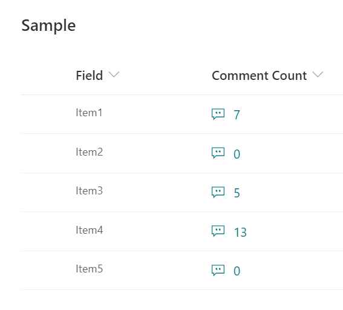
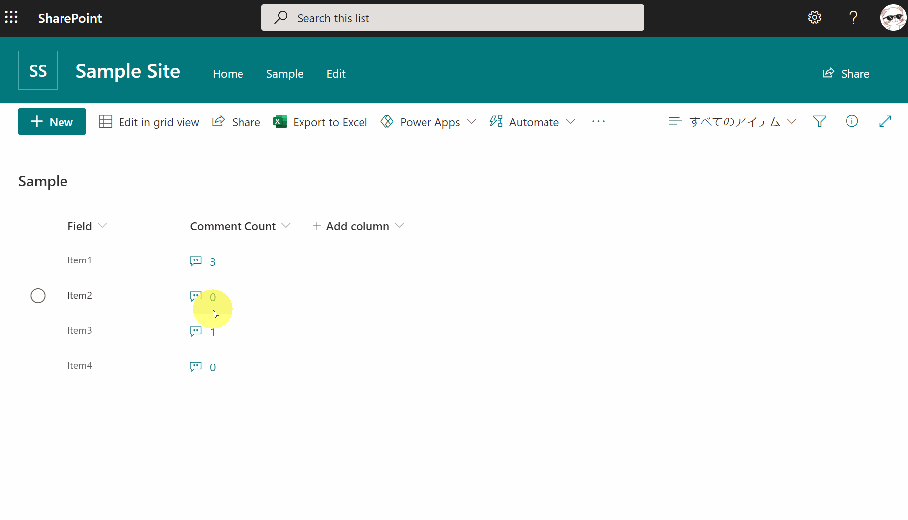

# Display Liczba komentarzy

## Podsumowanie
Ta próbka pokazuje the comment count for a list item.

## Wymagania widoku
Ten format można zastosować do any column type.

## Przykład

Rozwiązanie|Autor(zy)
--------|---------
generic-comment-count.json | [Tetsuya Kawahara](https://github.com/tecchan1107)

## Historia wersji

Wersja |Data             |Uwagi
--------|-----------------|--------
1.0     |grudnia 3, 2020 |Wersja początkowa

## Zastrzeżenie
**TEN KOD JEST DOSTARCZANY W STANIE *TAKIM, W JAKIM JEST*, BEZ JAKIEJKOLWIEK GWARANCJI, WYRAŹNEJ ANI DOROZUMIANEJ, W TYM TAKŻE DOROZUMIANYCH GWARANCJI PRZYDATNOŚCI DO OKREŚLONEGO CELU, WARTOŚCI HANDLOWEJ ANI NIENARUSZANIA PRAW.**

