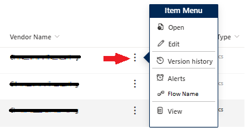
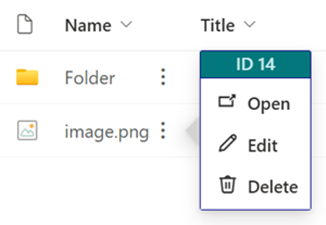
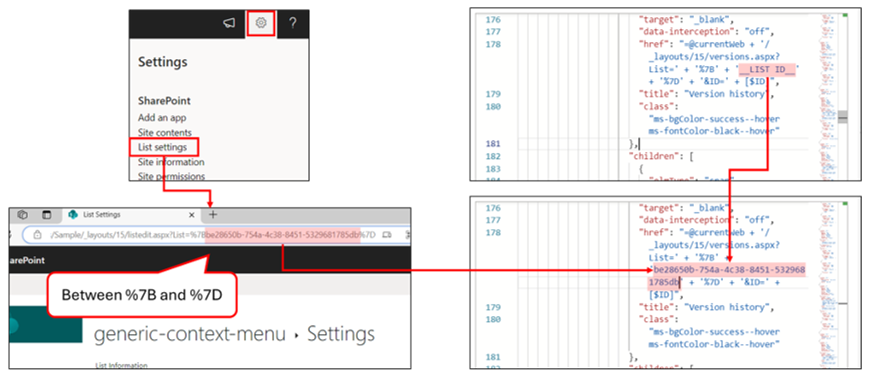
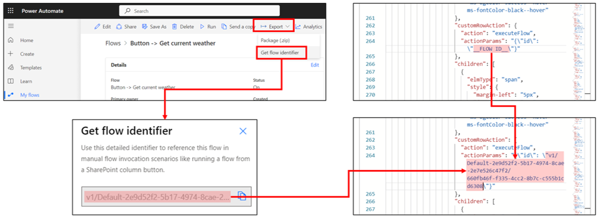

# Context Menu

## Podsumowanie

Próbka is a simple version of the current context menu. It allows you to customize the menu options and link to the most user of visited links. You can add links to Flows, web pages, or other items specific the the item it is on. It can be added to any customizable field, but adding it to the Title field helps eliminate confusion.

 

## Setting Up for Sample Usage

To use this sample, you need to modify `__LIST ID__` and `__FLOW ID__` in [generic-context-menu.json](./generic-context-menu.json) according to your environment. `__LIST ID__`" is specified on lines 178 and 224, and `__FLOW ID__` is specified on line 264.

- For `__LIST ID__`, set the value between %7B and %7D after List= in the URL of the list settings screen.

    

- For `__FLOW ID__`, get the flow identifier from the flow screen you want to execute and set that. (Reference: [Advanced formatting concepts - Create a button to launch a Flow](https://learn.microsoft.com/sharepoint/dev/declarative-customization/formatting-advanced#create-a-button-to-launch-a-flow))

    

## Wymagania widoku

Ten format można zastosować do any column type.

## Przykład

Rozwiązanie|Autor(zy)
--------|---------
generic-context-menu.json | [Larry Pfaff](https://github.com/jaxkookie)
generic-context-menu-minimal.json | [Watana](https://github.com/watana2)

## Historia wersji

Wersja |Data          |Uwagi
--------|--------------|--------------------------------
1.0     |April 2, 2024 |Wersja początkowa
1.1     |February 17, 2025 |Dodano generic-context-menu-minimal.json

## Zastrzeżenie

**TEN KOD JEST DOSTARCZANY W STANIE *TAKIM, W JAKIM JEST*, BEZ JAKIEJKOLWIEK GWARANCJI, WYRAŹNEJ ANI DOROZUMIANEJ, W TYM TAKŻE DOROZUMIANYCH GWARANCJI PRZYDATNOŚCI DO OKREŚLONEGO CELU, WARTOŚCI HANDLOWEJ ANI NIENARUSZANIA PRAW.**

