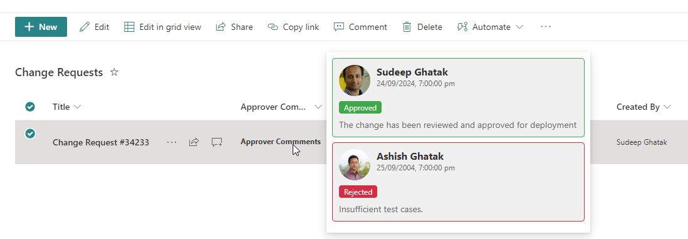

# Custom Approver Hover Card

## Podsumowanie
The approval hover card provides an intuitive, streamlined way for users to quickly access key details about an approval details without navigating away from their current task or screen.

## Wymagania widoku
- Ten format można zastosować do any column type. In the example it has been applied on **ApproverComments**.

| Internal Name            | Type                | Notes                                                       |
|--------------------------|---------------------|-------------------------------------------------------------|
| Approver1Comments        | Single line of text |                                                             |
| Approver2Comments        | Single line of text |                                                             |
| Approver1Response        | Choice              | "Approved","Rejected","Pending"                             |
| Approver2Response        | Choice              | "Approved","Rejected","Pending"                             |
| Approver1                | Person or Group     |                                                             |
| Approver2                | Person or Group     |                                                             |
| Approver1RespondedOn     | Date and Time       |                                                             |
| Approver2RespondedOn     | Date and Time       |                                                             |

## Przykład

Rozwiązanie|Autor(zy)
--------|---------
generic-custom-hover-card-approvers.json | [Sudeep Ghatak](https://github.com/sudeepghatak)

## Historia wersji

Wersja|Data|Uwagi
-------|----|--------
1.0|September 24, 2024|Wersja początkowa

## Zastrzeżenie
**TEN KOD JEST DOSTARCZANY W STANIE *TAKIM, W JAKIM JEST*, BEZ JAKIEJKOLWIEK GWARANCJI, WYRAŹNEJ ANI DOROZUMIANEJ, W TYM TAKŻE DOROZUMIANYCH GWARANCJI PRZYDATNOŚCI DO OKREŚLONEGO CELU, WARTOŚCI HANDLOWEJ ANI NIENARUSZANIA PRAW.**

