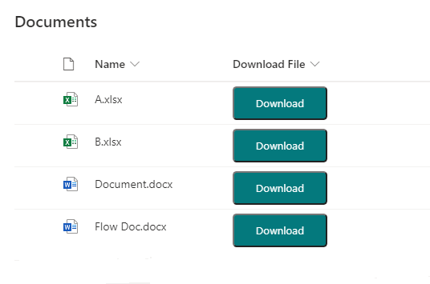

# Download File Button

## Podsumowanie

Ta próbka pokazuje adding a button within a document library view which downloads the file.

## Wymagania widoku

Ten format można zastosować do any column type (its value is ignored).

## Przykład

Rozwiązanie|Autor(zy)
--------|---------
generic-download-file-button.json | [Ganesh Sanap](https://github.com/ganesh-sanap)

## Historia wersji

Wersja |Data          |Uwagi
--------|--------------|--------------------------------
1.0     |January 05, 2022 |Wersja początkowa
1.1     |January 07, 2023 |Changed button hide condition.

## Zastrzeżenie

**TEN KOD JEST DOSTARCZANY W STANIE *TAKIM, W JAKIM JEST*, BEZ JAKIEJKOLWIEK GWARANCJI, WYRAŹNEJ ANI DOROZUMIANEJ, W TYM TAKŻE DOROZUMIANYCH GWARANCJI PRZYDATNOŚCI DO OKREŚLONEGO CELU, WARTOŚCI HANDLOWEJ ANI NIENARUSZANIA PRAW.**

