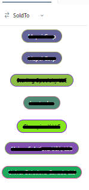

# Dynamic Colored Pills

## Podsumowanie

Ta próbka pokazuje how to dynamically add colored pills to lookup columns. If you have a lookup column with more than 10 options or a lookup column that can have additional items added, managing the pill colors can be time-consuming. This format will calculate a color, background, and border color based on the length of the lookup value and the lookupId.

## Wymagania widoku
This code can be applied to any lookup column

## Przykład

Rozwiązanie|Autor(zy)
--------|---------
generic-dynamic-colored-pills.json | [Larry Pfaff](https://github.com/jaxkookie)

## Historia wersji

Wersja |Data          |Uwagi
--------|--------------|--------------------------------
1.0     |July 17, 2024 |Wersja początkowa
1.1     |September 12, 2025 |Sample Updates

## Zastrzeżenie

**TEN KOD JEST DOSTARCZANY W STANIE *TAKIM, W JAKIM JEST*, BEZ JAKIEJKOLWIEK GWARANCJI, WYRAŹNEJ ANI DOROZUMIANEJ, W TYM TAKŻE DOROZUMIANYCH GWARANCJI PRZYDATNOŚCI DO OKREŚLONEGO CELU, WARTOŚCI HANDLOWEJ ANI NIENARUSZANIA PRAW.**

