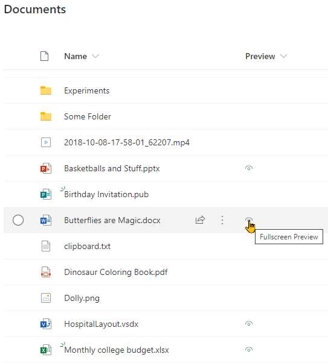

# File Preview

## Podsumowanie
Ta próbka otwiera Microsoft Office documents in full screen within a new tab. This is the same view as used in the fileviewer webpart (no toolbars).

## Wymagania widoku
- This format is intended for document libraries
- Format can be applied to any column, although it is recommended to add it to a calculated column with a ="" formula
- Only specific file types are supported (see below)

### Supported File Types

Ten format opiera się na `Doc.aspx` which supports the viewing of Microsoft Office documents. Format only displays for the following extensions:

- **Word**: docx, dotx, dotm, docm, docb
- **PowerPoint**: pptx, pptm, potx, potm, ppam, ppsx, ppsm, sldx, sldm
- **Visio**: vsdx
- **Excel**: xlsx, xlsm, xltx, xltm

> This list of extensions can be adjusted by either removing or adding another condition in the `display` style property.

## Przykład

Rozwiązanie|Autor(zy)
--------|---------
generic-file-preview.json | [Geert de Kooter](https://github.com/gdk-max)

## Historia wersji

Wersja|Data|Uwagi
-------|----|--------
1.0|August 08, 2020|Wersja początkowa
2.0|January 26, 2022|When the filetype is not of the supported filetypes, it will open in a new window, the icon changes to reflect this behavior.

## Zastrzeżenie
**TEN KOD JEST DOSTARCZANY W STANIE *TAKIM, W JAKIM JEST*, BEZ JAKIEJKOLWIEK GWARANCJI, WYRAŹNEJ ANI DOROZUMIANEJ, W TYM TAKŻE DOROZUMIANYCH GWARANCJI PRZYDATNOŚCI DO OKREŚLONEGO CELU, WARTOŚCI HANDLOWEJ ANI NIENARUSZANIA PRAW.**

---

## Dodatkowe uwagi
none

