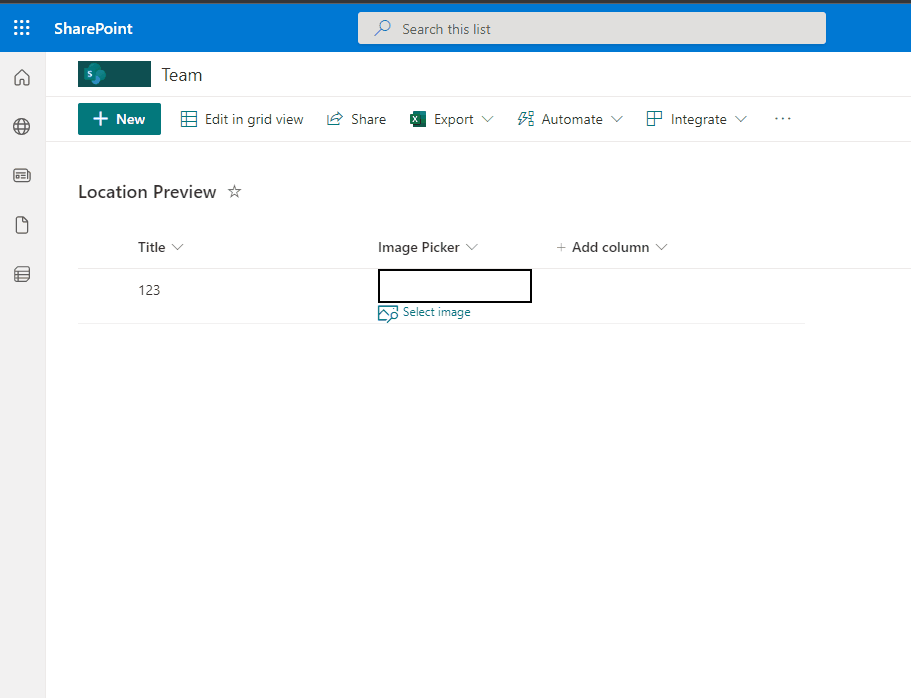

# File Picker

## Podsumowanie
Ta próbka pokazuje how to prompt users to copy a file link from a specific library and displays it in the column.

## Wymagania widoku
- Ten format można zastosować do any `Single line of Text` Column with Title `FilePicker`.

## Przykład

Rozwiązanie|Autor(zy)
--------|---------
generic-filepicker.json | [André Lage](https://github.com/aaclage)

- Replace `[replaceUrlPathtoLibrary]` with path to SharePoint Library, sample: '/SiteAssets/'

## Historia wersji

Wersja|Data|Uwagi
-------|----|--------
1.0|May 27, 2022|Wersja początkowa

## Zastrzeżenie
**TEN KOD JEST DOSTARCZANY W STANIE *TAKIM, W JAKIM JEST*, BEZ JAKIEJKOLWIEK GWARANCJI, WYRAŹNEJ ANI DOROZUMIANEJ, W TYM TAKŻE DOROZUMIANYCH GWARANCJI PRZYDATNOŚCI DO OKREŚLONEGO CELU, WARTOŚCI HANDLOWEJ ANI NIENARUSZANIA PRAW.**

---

