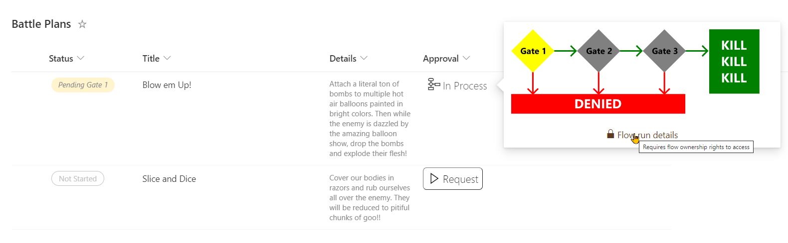
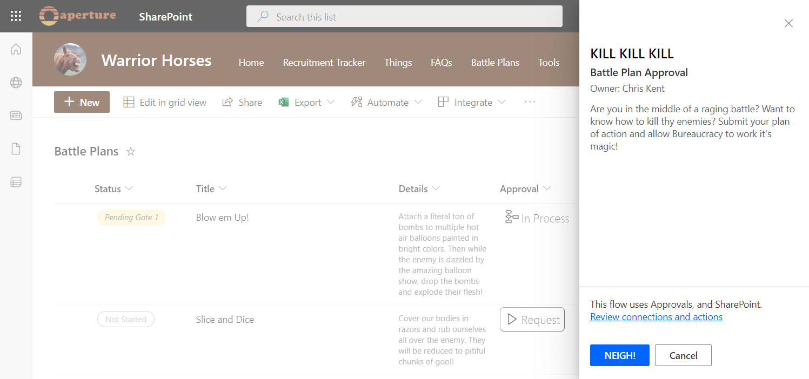
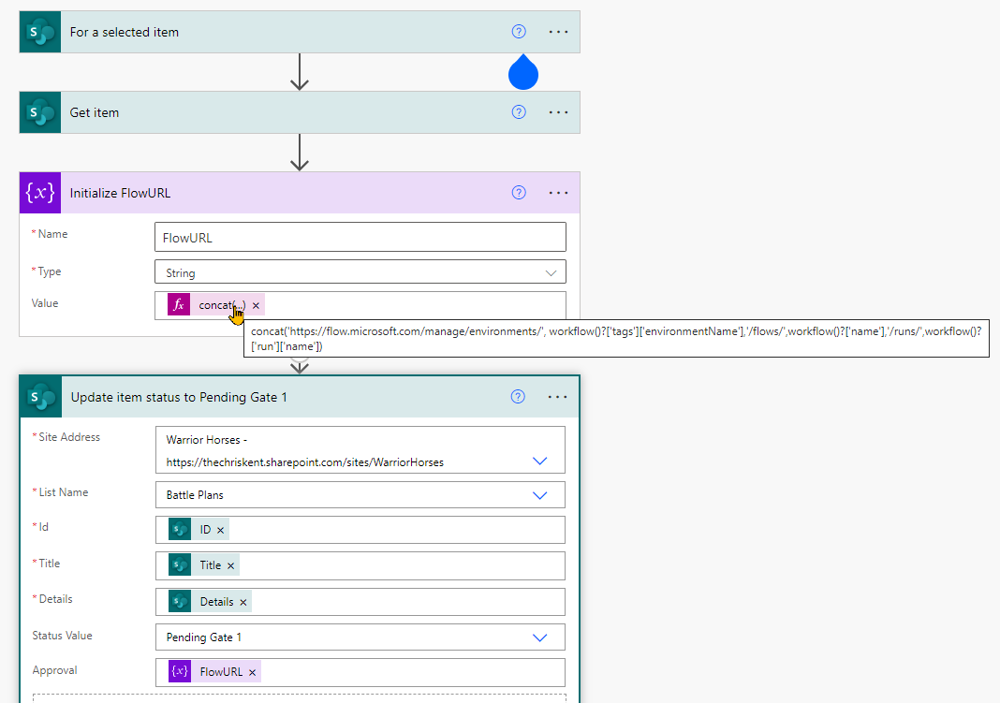

# Flow Status

## Podsumowanie



Ta próbka warunkowo wyświetla przycisk uruchamiający przepływ. Dodatkowe szczegóły pozwalają dostosować tytuł panelu przepływu i sam przycisk. Daje to użytkownikom więcej kontekstu i jest zwykle znacznie bardziej zrozumiałe niż domyślne "Run Flow", które często niewiele mówi użytkownikom końcowym.



### Power Automate flow instance URL

The associated Power Automate flow uses an expression to build a URL that will point to the exact instance of the flow. This is very helpful for finding exactly which run applies to a list item (the alternative is to open each flow and check the details). The expression used is:

```
concat('https://flow.microsoft.com/manage/environments/', workflow()?['tags']['environmentName'],'/flows/',workflow()?['name'],'/runs/',workflow()?['run']['name’])
```

This expression can be used in any flow.

In this sample, both the status and the flow url are updated (the flow url field is where the format is applied). This allows the format to turn off the launch flow button for items that are already in progress and provide a link to the exact instance for any troubleshooting.



### Flow Diagram

The process status shown in the hover card was created in Visio and saved as an SVG. The [HTML to Formatter](https://pnp.github.io/List-Formatting/tools/html-formatter-generator/) tool was used to quickly convert the SVG into a format and that was adapted to add the conditional logic for fill colors.

## Wymagania widoku
- Ten format powinien być zastosowany do a text column where the value of the field is the flow instance URL (see above).

|Type|Internal Name|Required|
|---|---|:---:|
|Choice|Status|Yes|

Kolumna Status używa następujących wartości (but you use different values, just update the format accordingly):
- Not Started
- Pending Gate 1
- Pending Gate 2
- Pending Gate 3
- Approved
- Rejected

## Przykład

Rozwiązanie|Autor(zy)
--------|---------
generic-flow-status.json | [Chris Kent](https://github.com/thechriskent)

## Historia wersji

Wersja|Data|Uwagi
-------|----|--------
1.0|April 15, 2022|Wersja początkowa

## Zastrzeżenie
**TEN KOD JEST DOSTARCZANY W STANIE *TAKIM, W JAKIM JEST*, BEZ JAKIEJKOLWIEK GWARANCJI, WYRAŹNEJ ANI DOROZUMIANEJ, W TYM TAKŻE DOROZUMIANYCH GWARANCJI PRZYDATNOŚCI DO OKREŚLONEGO CELU, WARTOŚCI HANDLOWEJ ANI NIENARUSZANIA PRAW.**

---


