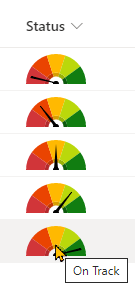

# Generic Gauge

## Podsumowanie
Ta próbka pokazuje combining a fixed SVG (gauge background) with a dynamic SVG (needle). The values are based on text values (choice or text).

> This sample is an adaptation of the [number-gauge](../number-gauge/) sample that shows how to represent a percent column with a dynamic gauge.

## Wymagania widoku

Ten format można zastosować do any column. As written, it is expecting the values to be one of the following:
- Critical
- Off Track
- At Risk
- Some Concerns
- On Track

To use custom values, simply to a find and replace with your equivalent values.

## Przykład

Rozwiązanie|Autor(zy)
--------|---------
generic-gauge.json | [Chris Kent](https://github.com/thechriskent)

## Historia wersji

Wersja|Data|Uwagi
-------|----|--------
1.0|26 kwietnia 2022|Wersja początkowa

## Zastrzeżenie
**TEN KOD JEST DOSTARCZANY W STANIE *TAKIM, W JAKIM JEST*, BEZ JAKIEJKOLWIEK GWARANCJI, WYRAŹNEJ ANI DOROZUMIANEJ, W TYM TAKŻE DOROZUMIANYCH GWARANCJI PRZYDATNOŚCI DO OKREŚLONEGO CELU, WARTOŚCI HANDLOWEJ ANI NIENARUSZANIA PRAW.**

---

## Dodatkowe uwagi

- [Użyj formatowania kolumn do dostosowania SharePoint](https://docs.microsoft.com/en-us/sharepoint/dev/declarative-customization/column-formatting)

