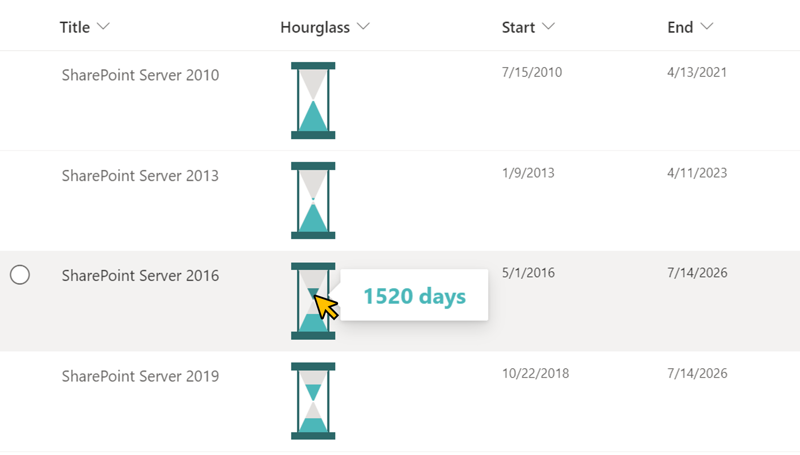

# Display Hourglass

## Podsumowanie
Ta próbka pokazuje displaying an hourglass. Sand begins to fall when it is time for the `Start` column, and all sand falls when it is time for the `End` column. Also, when you hover the mouse over the sand, the number of days is displayed.

## Wymagania widoku
Ten format można zastosować do any column type but expects the following columns to be part of the view:

|Type          |Internal Name |Wymagane|
|--------------|--------------|:------:|
|Data and Time |Start         |Yes     |
|Data and Time |End           |Yes     |

## Przykład

Rozwiązanie|Autor(zy)
--------|---------
generic-hourglass.json | [Tetsuya Kawahara](https://github.com/tecchan1107)

## Historia wersji

Wersja |Data         |Uwagi
--------|-------------|----------------
1.0     |maja 15, 2022 |Wersja początkowa

## Zastrzeżenie
**TEN KOD JEST DOSTARCZANY W STANIE *TAKIM, W JAKIM JEST*, BEZ JAKIEJKOLWIEK GWARANCJI, WYRAŹNEJ ANI DOROZUMIANEJ, W TYM TAKŻE DOROZUMIANYCH GWARANCJI PRZYDATNOŚCI DO OKREŚLONEGO CELU, WARTOŚCI HANDLOWEJ ANI NIENARUSZANIA PRAW.**

