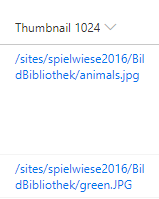

# File Thumbnails or Hyperlinks

## Podsumowanie
This example uses a column to generate a hyperlink to the Item Thumbnail for a document library.
* Uses FileRef Variable
* Uses getpreview.ashx

### Before you use generic-hyperlink-thumbnail
* Adjust the resolution=**3** (0-6) value to your NEEDS. _(3: 1024px, 4: 1600px)_

### generic-image-thumbnail 
basics from: https://github.com/pnp/List-Formatting/tree/master/column-samples/picture-roundimage-format

* Adjust Thumbnail Sizes or Rounded Edges to your NEEDS. 

## Wymagania widoku
- Ten format można zastosować do any column type (the value is ignored)
- This format should be used in a Document Library

## Przykład

Rozwiązanie|Autor(zy)
--------|---------
generic-hyperlink-thumbnail.json | [Josef Lahmer](https://github.com/josy1024)
generic-image-thumbnail.json | [Josef Lahmer](https://github.com/josy1024)

## Historia wersji

Wersja|Data|Uwagi
-------|----|--------
1.0|July 17, 2018 |Wersja początkowa
1.1|August 20, 2018|Switched to Excel-style expressions
1.2|January 9, 2019|Removed hardcoded url and replaced with @currentWeb token
1.3|April 9, 2019|Bug fix in @currentWeb, + generic-image-thumbnail

## Zastrzeżenie
**TEN KOD JEST DOSTARCZANY W STANIE *TAKIM, W JAKIM JEST*, BEZ JAKIEJKOLWIEK GWARANCJI, WYRAŹNEJ ANI DOROZUMIANEJ, W TYM TAKŻE DOROZUMIANYCH GWARANCJI PRZYDATNOŚCI DO OKREŚLONEGO CELU, WARTOŚCI HANDLOWEJ ANI NIENARUSZANIA PRAW.**

---

## Dodatkowe uwagi
- [Użyj formatowania kolumn do dostosowania SharePoint](https://docs.microsoft.com/en-us/sharepoint/dev/declarative-customization/column-formatting)

> An additional version using Abstract Tree Syntax (AST) is also provided for environments where the Excel-style expressions are not supported.

