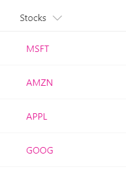

# Dynamic Links  

## Podsumowanie
This example shows how to turn a text field that contains stock ticker symbols into a hyperlink that targets the Yahoo Finance real-time quotes page for that stock ticker. The example uses a `+` operator that appends the current field value to the static hyperlink <a>http://finance.yahoo.com/quote/</a>. You can extend this pattern to any scenario in which you want users to view contextual information related to an item, or you want to start a business process on the current item, as long as the information or process can be accessed via a hyperlink parameterized with values from the list item.

## Wymagania widoku
- Ten format można zastosować do any column type

## Przykład

Rozwiązanie|Autor(zy)
--------|---------
generic-hyperlink-values.json | [SharePoint Team](https://github.com/SharePoint)

## Historia wersji

Wersja|Data|Uwagi
-------|----|--------
1.0|2 listopada 2017|Wersja początkowa
1.1|20 sierpnia 2018|Przełączono na wyrażenia w stylu Excela

## Zastrzeżenie
**TEN KOD JEST DOSTARCZANY W STANIE *TAKIM, W JAKIM JEST*, BEZ JAKIEJKOLWIEK GWARANCJI, WYRAŹNEJ ANI DOROZUMIANEJ, W TYM TAKŻE DOROZUMIANYCH GWARANCJI PRZYDATNOŚCI DO OKREŚLONEGO CELU, WARTOŚCI HANDLOWEJ ANI NIENARUSZANIA PRAW.**

---

## Dodatkowe uwagi
Ta próbka jest również opisana w głównej dokumentacji dotyczącej formatowania kolumn

- [Użyj formatowania kolumn do dostosowania SharePoint](https://docs.microsoft.com/en-us/sharepoint/dev/declarative-customization/column-formatting)

> Dodatkowa wersja wykorzystująca Abstract Tree Syntax (AST) jest również dostępna dla środowisk, w których wyrażenia w stylu Excela nie są obsługiwane.

