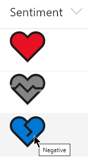
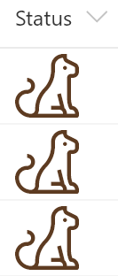
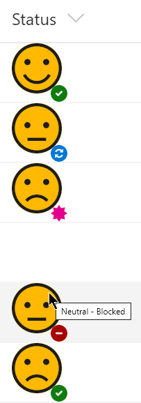

# Icon Overlays  

## Podsumowanie
Możesz używać ikon UI Fabric w formatach kolumn i widoków. Ta próbka pokazuje łączenie wielu ikon przez nakładanie ich na siebie, aby tworzyć kolorowe ikony przekazujące więcej informacji niż pojedyncza ikona.

Overlays are done by using a parent element with a `style` -> `position` value of `relative`. Then we can have the child elements use a `position` value of `absolute` to precisely overlay the icons where we want them.

### generic-icon-overlay.json

Ta próbka pokazuje using a solid icon (HeartFill) to provide a colored background to our icon and overlaying a wireframe icon to create an outline. The icons are shown conditionally based on the value. Using this technique with the various Solid, Mask, and Fill icons available can create far more icons than are currently available and allows more precise control of the coloring.

#### Wymagania widoku
- Ten format powinien być zastosowany do a text or choice column with the following values:
  - Positive
  - Negative
  - Neutral

### simple-icon.json

This is a very basic sample that simply displays a Cat icon and is helpful for demonstrating how to display an icon and set it's size and color. The icon and color are NOT conditionally set (see the other files in this sample for examples of that). In this case, the theme color has been applied with a class but it could just as easily have been set using the `style` -> `color` property.

#### Wymagania widoku
- Ten format można zastosować do any column type (the value is ignored)

### generic-icon-overlay-multiple

#### Wymagania widoku
- Ten format powinien być zastosowany do a text or choice column with the following values:
  - In progress
  - In review
  - Done
  - Blocked
- An additional column with an internal name of Sentiment (text or choice) is expected with the following values:
  - Positive
  - Negative
  - Neutral

## Przykład

Rozwiązanie|Autor(zy)
--------|---------
generic-icon-overlay.json | [Chris Kent](https://github.com/thechriskent)
simple-icon.json | [Chris Kent](https://github.com/thechriskent)
generic-icon-overlay-multiple.json | [Chris Kent](https://github.com/thechriskent)

## Historia wersji

Wersja|Data|Uwagi
-------|----|--------
1.0|9 stycznia 2020|Wersja początkowa

## Zastrzeżenie
**TEN KOD JEST DOSTARCZANY W STANIE *TAKIM, W JAKIM JEST*, BEZ JAKIEJKOLWIEK GWARANCJI, WYRAŹNEJ ANI DOROZUMIANEJ, W TYM TAKŻE DOROZUMIANYCH GWARANCJI PRZYDATNOŚCI DO OKREŚLONEGO CELU, WARTOŚCI HANDLOWEJ ANI NIENARUSZANIA PRAW.**

---

