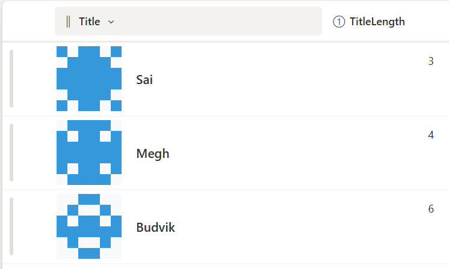

# Formatowanie kolumny identikony

## Podsumowanie
Ta próbka pokazuje how to use **SharePoint Column Formatting** to generate **Identicons** for list items.  
Each identicon is a small visual grid that represents the `Title` of the item, making it easier to identify items at a glance.



### Przykład Overview

- Identicons are **6x7 grids of colored squares**.
- Colors are generated based on a calculated **TitleLength** column.
- Works in **modern SharePoint list views**.
- Displayed alongside the **Title** column for quick identification.

## Wymagania widoku

Utwórz listę SharePoint z następującymi kolumnami:

| Internal Name   | Type                     |
|-----------------|--------------------------|
| **Title**       | Pojedyncza linia tekstu      |
| **TitleLength** | Calculated (Liczba)      |

> **TitleLength formula:**  
> ```
> =LEN([Title])
> ```  
> This calculates the number of characters in the `Title` and is used to generate the identicon pattern.

## Dane przykładowe

| Title          | TitleLength |
|----------------|------------|
| Sai            | 3         |
| Megh           | 2         |
| Budvik         | 5         |

The identicon pattern automatically updates based on `TitleLength`.

## Jak to działa

- Each square in the identicon grid is colored using a formula based on `TitleLength`.
- Squares change between two colors to produce a unique visual pattern.
- Supports **light and dark SharePoint themes**.
- Ideal for **list views** where quick visual identification is needed.

## Przykład

Rozwiązanie|Autor(zy)
--------|---------
generic-identicon.json | [Sai Bandaru](https://github.com/saiiiiiii)

## Historia wersji

| Version | Data       | Uwagi           |
|---------|------------|------------------|
| 1.0     | sierpnia 25, 2025 | Wersja początkowa |

## Zastrzeżenie
**TEN KOD JEST DOSTARCZANY W STANIE *TAKIM, W JAKIM JEST*, BEZ JAKIEJKOLWIEK GWARANCJI, WYRAŹNEJ ANI DOROZUMIANEJ, W TYM TAKŻE DOROZUMIANYCH GWARANCJI PRZYDATNOŚCI DO OKREŚLONEGO CELU, WARTOŚCI HANDLOWEJ ANI NIENARUSZANIA PRAW.**

---

## Dodatkowe uwagi

- Adjust colors or square size by editing the `generic-identicon.json`.
- Works best in modern SharePoint lists sorted by Title or other relevant columns.


