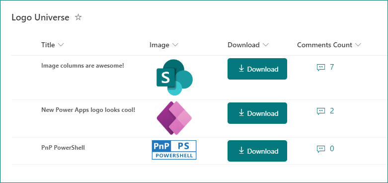

# Zróbwnload Image from SharePoint Image column

## Podsumowanie

Ta próbka pokazuje adding a button within a SharePoint Online/Microsoft Lists view which downloads the image from image column.

## Uwaga o JSON
For this JSON to work in your list, make sure to edit the JSON and replace the `**YOUR-LIST-NAME**` placeholder with your list's name, as it appears in the URL (including special characters)

## Wymagania widoku

Ten format można zastosować do any column type (its value is ignored). However, it is expected that the following one column is part of the view.

|Type  |Internal Name |Wymagane|
|------|--------------|:------:|
|Image |Image         |No      |

## Przykład

Rozwiązanie|Autor(zy)
--------|---------
generic-image-download.json | [Ganesh Sanap](https://github.com/ganesh-sanap)

## Historia wersji

Wersja |Data          |Uwagi
--------|--------------|--------------------------------
1.0     |listopada 12, 2022 |Wersja początkowa
1.1     |stycznia 16, 2024 |Poprawiono an issue where images could not be downloaded due to a change in image storage location

## Zastrzeżenie

**TEN KOD JEST DOSTARCZANY W STANIE *TAKIM, W JAKIM JEST*, BEZ JAKIEJKOLWIEK GWARANCJI, WYRAŹNEJ ANI DOROZUMIANEJ, W TYM TAKŻE DOROZUMIANYCH GWARANCJI PRZYDATNOŚCI DO OKREŚLONEGO CELU, WARTOŚCI HANDLOWEJ ANI NIENARUSZANIA PRAW.**

