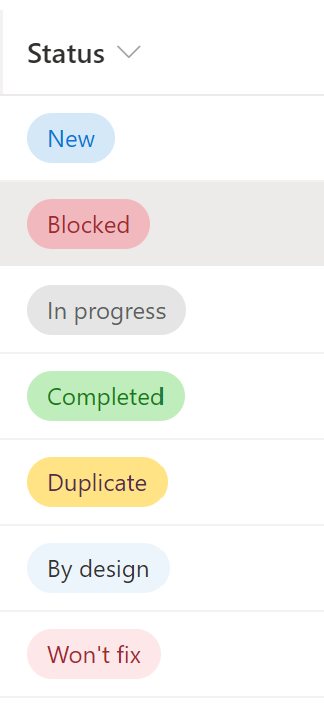

# Issue Status Pill 

## Podsumowanie
Ten format pokazuje, jak odtworzyć wybory statusu w formie pigułek znanych z szablonu Microsoft Lists Issue Tracker.

Możesz użyć tego formatowania, aby zaimplementować własną wersję układu *choices as pills*.

## Wymagania widoku
- Ten format można zastosować do any text/choice column, but expects the column values to be one of the following choices:
  - Blocked
  - In progress
  - Completed
  - Duplicate
  - By design
  - Won't fix
  - New

## Przykład

Rozwiązanie|Autor(zy)
--------|---------
generic-issuestatus-pill.json | [Hugo Bernier](https://github.com/hugoabernier)

## Historia wersji

Wersja|Data|Uwagi
-------|----|--------
1.0|30 lipca 2020|Wersja początkowa

## Zastrzeżenie
**TEN KOD JEST DOSTARCZANY W STANIE *TAKIM, W JAKIM JEST*, BEZ JAKIEJKOLWIEK GWARANCJI, WYRAŹNEJ ANI DOROZUMIANEJ, W TYM TAKŻE DOROZUMIANYCH GWARANCJI PRZYDATNOŚCI DO OKREŚLONEGO CELU, WARTOŚCI HANDLOWEJ ANI NIENARUSZANIA PRAW.**

---

## Dodatkowe uwagi

- [Użyj formatowania kolumn do dostosowania SharePoint](https://docs.microsoft.com/en-us/sharepoint/dev/declarative-customization/column-formatting#me)

