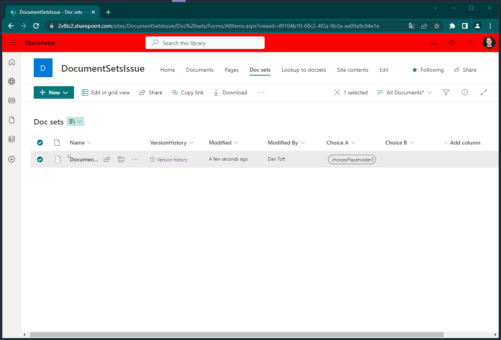
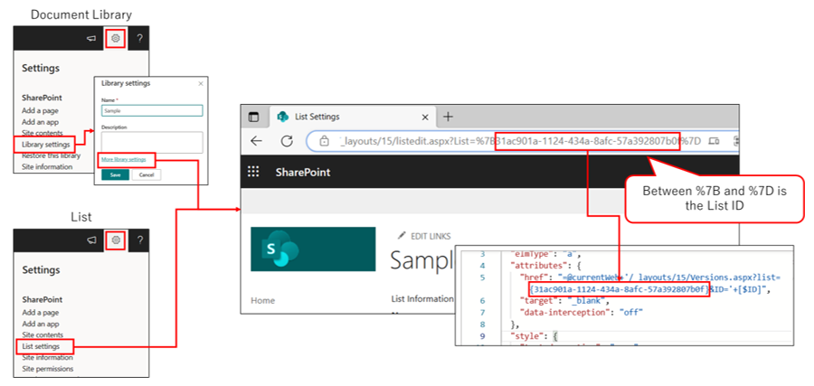

# Item Version History

## Podsumowanie
Since document sets rely on a different style of version history (captured versions) - sometimes you want to see how the metadata has changed over time, using the Versions.aspx page over the DocSetVersions.aspx works awesome, but this is also really useful just to make the version history for someone.

> [!NOTE]  
> If you use this sample, you need to set the __LIST ID__. If not set, the link will not work.
> 

## Wymagania widoku

- Ten format można zastosować do any column type, I used a calculated field with the _=""_ formula.

## Przykład

Rozwiązanie|Autor(zy)
--------|---------
generic-item-version-history.json | [Dan Toft](https://github.com/Tanddant)

## Historia wersji

| Version | Data         | Uwagi        |
| ------- | ------------ | --------------- |
| 1.0     | maja 12, 2023 | Wersja początkowa |

## Zastrzeżenie

**TEN KOD JEST DOSTARCZANY W STANIE *TAKIM, W JAKIM JEST*, BEZ JAKIEJKOLWIEK GWARANCJI, WYRAŹNEJ ANI DOROZUMIANEJ, W TYM TAKŻE DOROZUMIANYCH GWARANCJI PRZYDATNOŚCI DO OKREŚLONEGO CELU, WARTOŚCI HANDLOWEJ ANI NIENARUSZANIA PRAW.**

