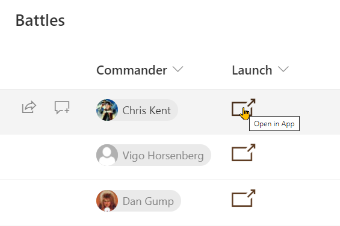
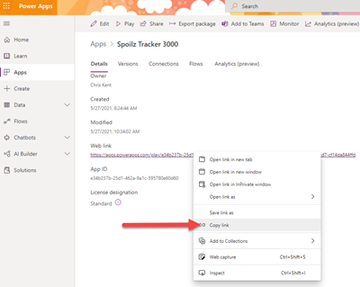

# Launch Power App Button

## Podsumowanie
Providing a direct link to an item within Power Apps is easy to do using this sample. To use it follow the instructions below to get the link to your Power App (and replace that portion of the format).




#### To obtain the link to your Power App

1. Login to [Power Apps](https://make.powerapps.com)
2. In your list of Apps, using the 3 dot context menu choose Details
3. Right-click on the Web link and choose Copy 



4. Replace the first part of the `href` value in the format (up to the `&hidenavbar` portion)

### Handling the itemId in your Power App

Deep linking in Power Apps is beyond the scope of this sample, but here's an example of how you might be handle it in a Canvas App:

**App.OnStart**
```
If(!IsBlank(Param("itemId")) && IsNumeric(Param("itemId")),
    Set(BattleItem, LookUp(Battles,ID=Value(Param("itemId"))));
)
```

**App.StartScreen**
```
If(!IsBlank(Param("itemId")) && IsNumeric(Param("itemId")), scrDetail, scrHome)
```

## Wymagania widoku
- Ten format można zastosować do any column type (its value is ignored)

> Tip - You can apply these formats to a Calculated Column with a formula of `=""`. This prevents the fields from storing data. Możesz również exclude them from your form by using a Conditional expression of `=false`.

## Przykład

Rozwiązanie|Autor(zy)
--------|---------
generic-launch-powerapp.json | [Chris Kent](https://github.com/thechriskent)

## Historia wersji

Wersja|Data|Uwagi
-------|----|--------
1.0|May 27, 2021|Wersja początkowa

## Zastrzeżenie
**TEN KOD JEST DOSTARCZANY W STANIE *TAKIM, W JAKIM JEST*, BEZ JAKIEJKOLWIEK GWARANCJI, WYRAŹNEJ ANI DOROZUMIANEJ, W TYM TAKŻE DOROZUMIANYCH GWARANCJI PRZYDATNOŚCI DO OKREŚLONEGO CELU, WARTOŚCI HANDLOWEJ ANI NIENARUSZANIA PRAW.**

---

## Dodatkowe uwagi

None


