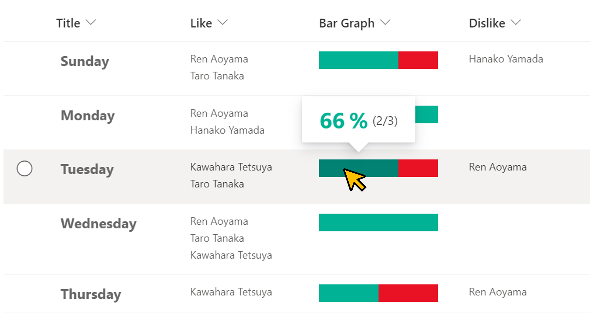
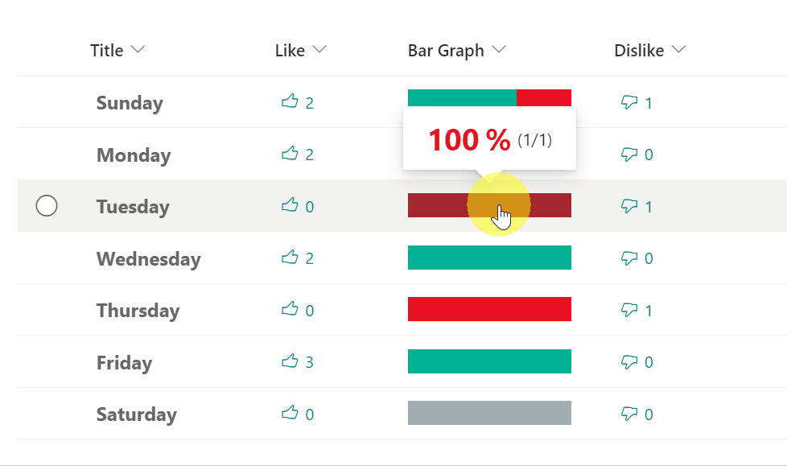

# Like/Dislike Bar

## Podsumowanie
Ta próbka pokazuje displaying a Like/Dislike bar that visualizes the ratio of Like to Dislike users.

Możesz połączyć tę próbkę z przykładem [multi-person-unique-reaction](../multi-person-reaction/), aby dodać przyciski Like i Dislike.

## Wymagania widoku
Ten format można zastosować do any column type but expects the following columns to be part of the view:

|Type                    |Internal Name  |Required|
|------------------------|---------------|:------:|
|Person or Group (Multi) |Like           |No      |
|Person or Group (Multi) |Dislike        |No      |

## Przykład

Rozwiązanie|Autor(zy)
--------|---------
generic-like-dislike-bar.json | [Tetsuya Kawahara](https://github.com/tecchan1107)

## Historia wersji

Wersja |Data           |Uwagi
--------|---------------|--------
1.0     |March 20, 2022 |Wersja początkowa

## Zastrzeżenie
**TEN KOD JEST DOSTARCZANY W STANIE *TAKIM, W JAKIM JEST*, BEZ JAKIEJKOLWIEK GWARANCJI, WYRAŹNEJ ANI DOROZUMIANEJ, W TYM TAKŻE DOROZUMIANYCH GWARANCJI PRZYDATNOŚCI DO OKREŚLONEGO CELU, WARTOŚCI HANDLOWEJ ANI NIENARUSZANIA PRAW.**

