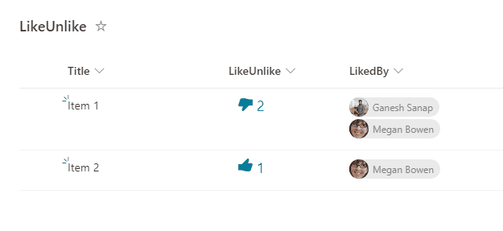

# Like/Unlike List Item

## Podsumowanie

Ta próbka pokazuje how to like/unlike a list item. Ta próbka wykorzystuje the `setValue` `customRowAction` to update the number and person field.

## Wymagania widoku

Ten format można zastosować do any column type (its value is ignored). In addition, below fields needs to be defined:

|Type               |Internal Name|Wymagane|Uwagi|
|-------------------|-------------|--------|--------|
|Liczba|LikesCount      |No      |Default value = 0|
|Person|LikedBy      |No      |Allow multiple selections|

## Przykład

Rozwiązanie|Autor(zy)
--------|---------
generic-like-unlike.json | [Ganesh Sanap](https://github.com/ganesh-sanap)

## Historia wersji

Wersja |Data          |Uwagi
--------|--------------|--------------------------------
1.0     |listopada 27, 2021 |Wersja początkowa

## Zastrzeżenie

**TEN KOD JEST DOSTARCZANY W STANIE *TAKIM, W JAKIM JEST*, BEZ JAKIEJKOLWIEK GWARANCJI, WYRAŹNEJ ANI DOROZUMIANEJ, W TYM TAKŻE DOROZUMIANYCH GWARANCJI PRZYDATNOŚCI DO OKREŚLONEGO CELU, WARTOŚCI HANDLOWEJ ANI NIENARUSZANIA PRAW.**

