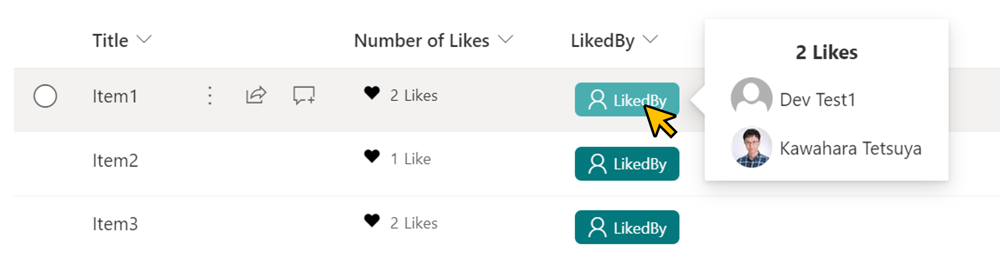
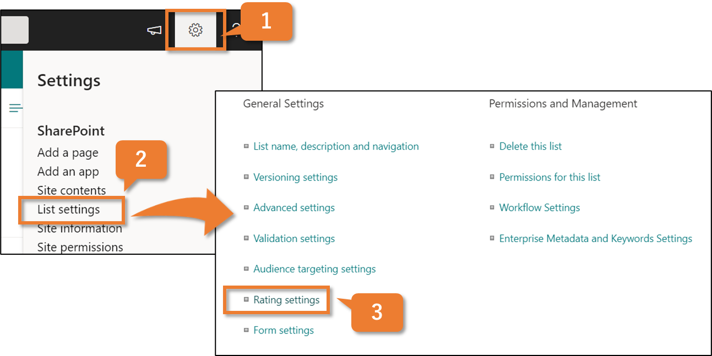
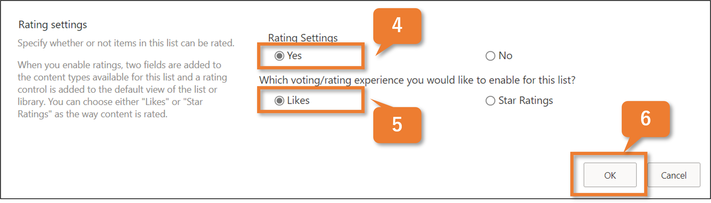

# Liked By Users

## Podsumowanie
Ta próbka pokazuje showing the users who have liked an item.



## Wymagania wstępne
### Enabling the ratings feature
The ratings feature is available by default in the team site, but not in the communication site. If you want to use the ratings feature in the list of communication sites, you need to enable the feature GUID ` 915c240e-a6cc-49b8-8b2c-0bff8b553ed3`. Poniższe is an example of how to enable it using [PnP PowerShell](https://pnp.github.io/powershell).

```
$targetURL = "https://<tenent name>.sharepoint.com/sites/<site name>"
Connect-PnPOnline -Url $targetURL -Interactive
Enable-PnPFeature –identity 915c240e-a6cc-49b8-8b2c-0bff8b553ed3 -Scope site
Disconnect-PnPOnline
```

### Add a ratings feature to the list
1. Click **gear icon**
2. Click **List Settings**
3. Under **General Settings**, click **Rating settings**.

   

4. Under **Allow items in this list to be rated?**, click **Yes**.
5. Under **Which voting/rating experience would you like to enable for this list?**, click **Likes**.
6. Click **OK**.

   

## Wymagania widoku

- Add a ratings feature to the list and display a like button.
- In addition, one field needs to be defined

|Type               |Internal Name|Required|
|-------------------|-------------|:------:|
|Single line of text|LikedBy      |No      |

## Przykład

Rozwiązanie|Autor(zy)
--------|---------
generic-likedby.json | [Tetsuya Kawahara](https://github.com/tecchan1107)

## Historia wersji

Wersja |Data            |Uwagi
--------|----------------|----------------
1.0     |October 22, 2021|Wersja początkowa

## Zastrzeżenie
**TEN KOD JEST DOSTARCZANY W STANIE *TAKIM, W JAKIM JEST*, BEZ JAKIEJKOLWIEK GWARANCJI, WYRAŹNEJ ANI DOROZUMIANEJ, W TYM TAKŻE DOROZUMIANYCH GWARANCJI PRZYDATNOŚCI DO OKREŚLONEGO CELU, WARTOŚCI HANDLOWEJ ANI NIENARUSZANIA PRAW.**

## Dodatkowe uwagi
- [PnP PowerShell](https://pnp.github.io/powershell)
- [Add a ratings feature to your library](https://support.microsoft.com/en-us/office/add-a-ratings-feature-to-your-library-5901fcfd-19ca-4f27-a65f-284654298552)


