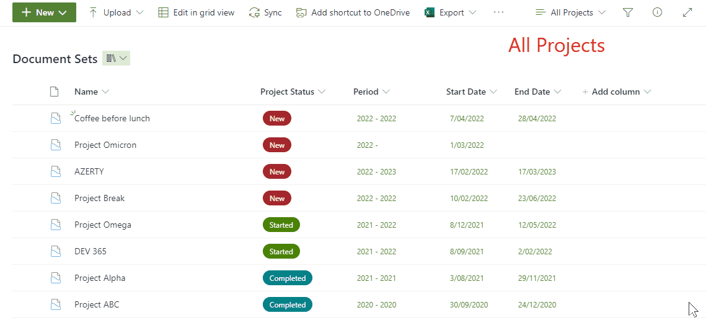

# Link to Parent Documentset

## Podsumowanie
The purpose of this sample is to enhance the use of documentsets. Assuming you have a SharePoint Library  with documentsets, it can be useful to create a view that shows all the files without the documentset (folder) structure. By adding a column to this view using this sample, users can open the parent documentset of a file.

## Wymagania widoku
- A library with documentsets
- A view showing all the recent documents
-- Folders: "Show all items without folders"
-- Filter: Content Type is not equal to NameOfTheDocumentSetContentType
- A "Single line of text" column, the column doesn't need to be linked to any content type

## Przykład

Rozwiązanie|Autor(zy)
--------|---------
generic-link-to-parent-documentset.json | [Geert de Kooter](https://github.com/gdk-max)

## Historia wersji

Wersja|Data|Uwagi
-------|----|--------
1.0|April 7, 2022|Wersja początkowa
2.0|January 20, 2023|Changed txtContent formula - based on the idea of Chris Kent

## Dodatkowe uwagi
none

## Zastrzeżenie

**TEN KOD JEST DOSTARCZANY W STANIE *TAKIM, W JAKIM JEST*, BEZ JAKIEJKOLWIEK GWARANCJI, WYRAŹNEJ ANI DOROZUMIANEJ, W TYM TAKŻE DOROZUMIANYCH GWARANCJI PRZYDATNOŚCI DO OKREŚLONEGO CELU, WARTOŚCI HANDLOWEJ ANI NIENARUSZANIA PRAW.**

