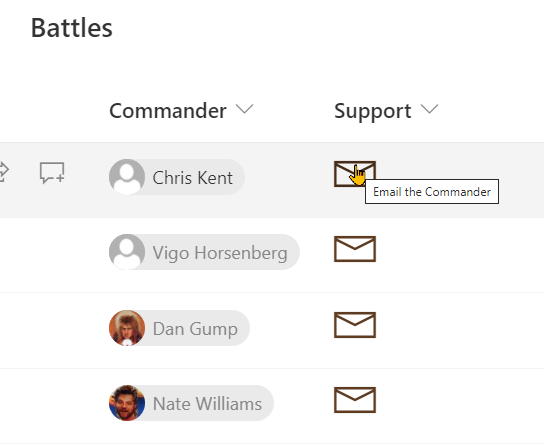

# MailTo Button

## Podsumowanie
Ta próbka pokazuje making a mailto link (opens email with prepopulated values) button that references a different field.

## Wymagania widoku
- Ten format można zastosować do any column type (its value is ignored)
- To apply directly to a person column, just replace all the `[$Commander]` calls with `@currentField`

> Tip - You can apply these formats to a Calculated Column with a formula of `=""`. This prevents the fields from being part of your edit/new forms.

## Przykład

Rozwiązanie|Autor(zy)
--------|---------
generic-mailto-button.json | [Chris Kent](https://github.com/thechriskent)

## Historia wersji

Wersja|Data|Uwagi
-------|----|--------
1.0|May 27, 2021|Wersja początkowa

## Zastrzeżenie
**TEN KOD JEST DOSTARCZANY W STANIE *TAKIM, W JAKIM JEST*, BEZ JAKIEJKOLWIEK GWARANCJI, WYRAŹNEJ ANI DOROZUMIANEJ, W TYM TAKŻE DOROZUMIANYCH GWARANCJI PRZYDATNOŚCI DO OKREŚLONEGO CELU, WARTOŚCI HANDLOWEJ ANI NIENARUSZANIA PRAW.**

---

## Dodatkowe uwagi

- The [person-mailto](../person-mailto/) demonstrates a similar technique but is applied directly to a person field

