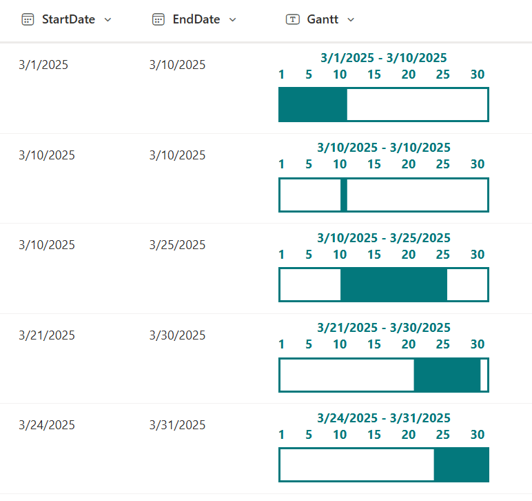

# Monthly Gantt Chart

## Podsumowanie
Ta próbka pokazuje the display of a monthly Gantt chart. The Gantt chart for the month corresponding to the `StartDate` value will be shown. For example, if the `StartDate` is marca 15, the Gantt chart for marca will be displayed; if the `StartDate` is kwietnia 2, the Gantt chart for kwietnia will be shown.

## Wymagania widoku
Ten format można zastosować do any column type but expects the following columns to be part of the view:

|Type|Internal Name|Wymagane|
|---|---|:---:|
|Data and Time|StartDate|Yes|
|Data and Time|EndDate|Yes|

## Przykład

Rozwiązanie|Autor(zy)
--------|---------
generic-monthly-gantt-chart.json | [Ahmed Mandour](https://github.com/AMandour)

## Historia wersji

Wersja |Data              |Uwagi
--------|------------------|--------
1.0     |lutego 16, 2025 |Wersja początkowa

## Zastrzeżenie
**TEN KOD JEST DOSTARCZANY W STANIE *TAKIM, W JAKIM JEST*, BEZ JAKIEJKOLWIEK GWARANCJI, WYRAŹNEJ ANI DOROZUMIANEJ, W TYM TAKŻE DOROZUMIANYCH GWARANCJI PRZYDATNOŚCI DO OKREŚLONEGO CELU, WARTOŚCI HANDLOWEJ ANI NIENARUSZANIA PRAW.**

---

## Dodatkowe uwagi

- Ta próbka wykorzystuje SVG to display the Gantt chart. The [generic-time-schedule](../generic-time-schedule/) displays a time-based schedule using the same approach.

